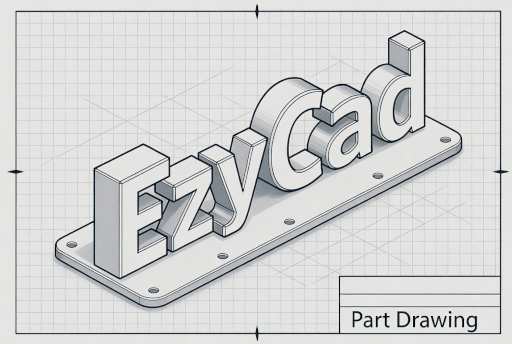

# EzyCad

**Repository:** [https://github.com/trailcode/EzyCad](https://github.com/trailcode/EzyCad)

EzyCad (Easy CAD) is an open-source CAD application for hobbyist machinists to design and edit 2D and 3D models for machining projects. It supports creating precise parts with tools for sketching, extruding, and applying geometric operations, using OpenGL, Dear ImGui, and Open CASCADE Technology (OCCT). Export models to formats like STEP or STL for CNC machines or 3D printers, or [run EzyCad in your browser (WebAssembly)](https://trailcode.github.io/EzyCad/EzyCad.html). Project home: [trailcode.github.io/EzyCad](https://trailcode.github.io/EzyCad/).

> **Not EZCAD laser software:** [EzyCad](https://github.com/trailcode/EzyCad) (with a **y**) is hobbyist mechanical CAD built on OCCT — unrelated to EZCAD2/EZCAD3 laser marking products.

## Downloads

Prebuilt **Windows** binaries (portable .zip containing `EzyCad.exe` + all required DLLs and assets) are published on the [GitHub Releases page](https://github.com/trailcode/EzyCad/releases).

- Go to [Releases](https://github.com/trailcode/EzyCad/releases) → expand "Assets" under the latest version.
- Download `EzyCad-vX.Y.Z-windows-x64.zip` (or the equivalent name), unzip, and run `EzyCad.exe`.
- No installer is required; the zip is self-contained.

**WebAssembly (browser) version:** [Run EzyCad directly in your browser](https://trailcode.github.io/EzyCad/EzyCad.html) (no download needed).

For source builds or other platforms, see the [Building Instructions](#building-instructions) below.

## Features
- 2D and 3D modeling capabilities.
- Integration with Open CASCADE for geometric operations.
- Cross-platform support with Emscripten for WebAssembly builds.
- Interactive GUI built with ImGui.

## Usage Guide
**Online:** [ezycad.readthedocs.io](https://ezycad.readthedocs.io/en/latest/usage.html) (built from this repo on [Read the Docs](https://readthedocs.org/)).

**Source:** [usage.md](docs/usage.md) and related guides in `docs/` (`usage-sketch.md`, `usage-settings.md`, `usage-occt-view.md`, etc.). They cover the user interface, modeling tools, keyboard shortcuts, and view controls.

## Changelog
Release history is in [CHANGELOG.md](CHANGELOG.md) (repository root). The user guides now live in the `docs/` folder (together with `building-occt.md`, style guides, etc.). With the CMake Visual Studio generator, documentation files appear under a `docs` folder (and the two root docs at project root) on the EzyCad / EzyCad_lib targets in Solution Explorer.

## Building Instructions

### Prerequisites
Ensure the following dependencies are installed:
- CMake (minimum version 3.14.0)
- Nuget command line utility
- A C++ 20 compatible compiler (e.g., MSVC, GCC, or Clang)
- OpenGL development libraries
- Open CASCADE Technology (OCCT 8.0.0) https://github.com/Open-Cascade-SAS/OCCT

### OCCT Build

Full guide: **[docs/building-occt.md](docs/building-occt.md)** (Windows prebuilts, wasm/Emscripten, troubleshooting).

#### For VS2022 (summary)
- See: https://dev.opencascade.org/doc/overview/html/build_upgrade__building_occt.html
- OCCT 3rd-party binaries: https://github.com/Open-Cascade-SAS/OCCT/releases/download/V8_0_0/3rdparty-vc14-64.zip
- Currently building EzyCad has only been tested with the Release build of OCCT.
- Or download pre-built binaries: https://github.com/Open-Cascade-SAS/OCCT/releases/tag/V8_0_0

### Steps to Build
1. Clone the repository.
2. Create a build directory, e.g., `C:\src\EzyCad_build`.
3. Configure the project in the build directory using CMake:
   - E.g., `cmake C:\src\EzyCad -DOpenCASCADE_DIR=C:\bin\OCCT-8_0_0_install\cmake -DOCCT_3RD_PARTY_DIR=C:\bin\3rdparty-vc14-64`
   - `OCCT_3RD_PARTY_DIR` should point to the OCCT 3rd-party distribution.
   - CMake will use `nuget` to download additional dependencies.
4. Build the project.

### Notes for Windows Users
- Ensure `nuget` is installed for fetching dependencies like GLFW and GLEW.
- Use Visual Studio as the IDE for debugging and building.

### Notes for Emscripten Builds
- Install Emscripten and activate its environment (`emsdk_env`).
- **OCCT 8.0.0 for wasm (recommended, current default):** Use the automated script `scripts\build-occt-v8-wasm.ps1` (or .cmd) after `emsdk_env` — see [docs/building-occt.md](docs/building-occt.md#webassembly-emscripten). 
- Configure the EzyCad project with Emscripten (Ninja recommended now):
  - `mkdir build_em` then `cd build_em`
  - Add **-Wno-dev** to suppress any remaining CMake developer warnings.  
    `emcmake cmake .. -Wno-dev -G Ninja -DOpenCASCADE_DIR=C:/path/to/occt-wasm-build/install/lib/cmake/opencascade -DCMAKE_BUILD_TYPE=Release`
  - If configure **freezes** after that warning, the hang is often in `find_package(OpenCASCADE)` or Emscripten compiler detection. Run with `--debug-output` to see where it stops.
  - Build:
    - `ninja` (or `emmake cmake --build . --config Release`)
- Build the project.
- Serve the WebAssembly: `python.exe -m http.server 8000` from the build output directory (look for `EzyCad.html` + `EzyCad.wasm` + `EzyCad.data`).
- Or build and serve: `ninja && python.exe -m http.server 8000`
- **GitHub Pages HTML:** After changing `web/index.html` or `web/EzyCad.html`, sync to [trailcode.github.io](https://github.com/trailcode/trailcode.github.io) with `scripts/sync-github-pages-html.ps1` (see script header).
- Dear ImGui under `third_party/imgui/` carries EzyCad-specific changes (font rendering); see [In-tree third-party libraries](#in-tree-third-party-libraries) at the end of this README.

### Artwork
- Icons from: https://wiki.freecad.org/Artwork

## Support and Contributions
- **Project home:** [trailcode.github.io/EzyCad](https://trailcode.github.io/EzyCad/)
- Report issues or suggest features on the [GitHub repository](https://github.com/trailcode/EzyCad).
- Contribute by developing features and fixing bugs. Pull requests are welcome!
- Additional resources, including video tutorials and online documentation, are linked in [usage.md](docs/usage.md).
- Outreach draft posts (forums, Reddit, awesome lists): [agents/discoverability-outreach.md](agents/discoverability-outreach.md).

### We need development help
EzyCad is maintained by a small team and we would love more contributors. If you can help with features, bug fixes, documentation, or testing - please jump in. Every contribution helps move the project forward.

**Style guides:** [ezycad_code_style.md](docs/ezycad_code_style.md) for C++ in `src/`; [ezycad_doc_style.md](docs/ezycad_doc_style.md) for user guides and [Read the Docs](https://ezycad.readthedocs.io/). Both human developers and AI coding agents should follow the relevant guide. Optional assistant-oriented snippets live under [agents/](agents/) (the repo does not commit `.cursor/`).

## In-tree third-party libraries

**Open CASCADE (OCCT) is not vendored here.** You build or install OCCT (and its binary redistributables) **outside** this tree and pass `OpenCASCADE_DIR` / `OCCT_3RD_PARTY_DIR` into CMake, as in [Building Instructions](#building-instructions) above.

The **`third_party/`** folder holds other libraries **shipped inside the EzyCad repository** (typically committed as a vendored snapshot, not fetched by CMake except where noted):

| Component | Location | Role |
| --- | --- | --- |
| **Dear ImGui** | `third_party/imgui/` | Immediate-mode UI used by the application. This tree includes **project-specific changes** for font rendering; see [imgui#7519 (comment)](https://github.com/ocornut/imgui/issues/7519#issuecomment-2629628233). |
| **nlohmann/json** | `third_party/json/` (headers under `include/`) | JSON used by the project; CMake adds `third_party/json/include`. |
| **tinyfiledialogs** | `third_party/tinyfiledialogs/` | Small C helper for native file dialogs on desktop. |
| **ImGuiColorTextEdit** | `third_party/ImGuiColorTextEdit/` | Syntax-highlighted editor widget for the **Lua** and **Python** script consoles ([upstream](https://github.com/BalazsJako/ImGuiColorTextEdit)). |

**ImGuiColorTextEdit:** Prefer a full checkout under `third_party/ImGuiColorTextEdit/` (see `third_party/README.md`). If that folder is missing, CMake **FetchContent** downloads upstream at a **fixed commit** (`ca2f9f1462e3b60e56351bc466acda448c5ea50d`) because the upstream repo has **no release tags**. To upgrade the editor, bump that SHA in `CMakeLists.txt` and refresh any vendored copy.

**Windows note:** GLFW and GLEW for MSVC are **not** stored under `third_party/`; NuGet installs them into **`${CMAKE_BINARY_DIR}/thirdParty`** when you configure (see [Notes for Windows Users](#notes-for-windows-users)).
