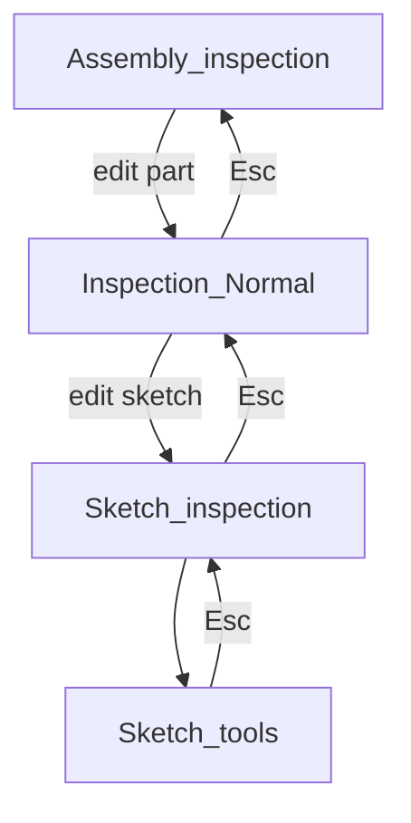

# Assembly inspection mode

**Load only when** the prompt is about assembly inspection / assembly idle mode, Part vs assembly context, or how Move/Duplicate relate to assemblies. Skip otherwise ([token-lean](../conventions/token-lean.md)). Index: [plans/README.md](README.md).

Post-v1 product design. Do **not** ship Assembly inspection until [phase 3 placement / Parts](shape-list-hierarchy-phase3.md) exist. This note explains *why* the mode fits CAD practice and *how* to introduce it without forking Move tools.

## Short answer

| Question                                                   | Answer                                                                                                       |
| ---------------------------------------------------------- | ------------------------------------------------------------------------------------------------------------ |
| Does assembly inspection align with CAD workflows?         | Yes — as a third idle context (sketch / part / assembly).                                                    |
| Should EzyCad add it now?                                  | No — assemblies are not first-class yet (only Shape List groups + baked transforms).                         |
| What makes Move “assembly-like” instead of “edit a solid”? | Relative **placement** on Parts (children follow), not rewriting BREP.                                       |
| Elegant fix for today’s awkwardness?                       | One Move/Rotate/Duplicate family; meaning from **selection kind**; Assembly inspection as arrange idle home. |

## Design-process framing

Two phases of work, two kinds of idle mode:

1. **Make geometry** — Sketch inspection + Inspection (`Mode::Normal`): draw profiles, see solids alongside (or faint), extrude, fillet, boolean.
2. **Arrange components** — Assembly inspection (future): duplicate / place / move Parts relative to each other; later mates and instances.

That split matches SolidWorks / Inventor / Fusion (sketch nested in part, part nested in assembly). EzyCad names the idle states “inspection” (= browse/select + launch tools + Esc parent), not metrology “Inspect.”

## What exists today

| UI label               | Mode                           | Role                                                                          |
| ---------------------- | ------------------------------ | ----------------------------------------------------------------------------- |
| Inspection mode        | `Mode::Normal`                 | Idle 3D solids: selection filter, materials, booleans, transforms             |
| Sketch inspection mode | `Mode::Sketch_inspection_mode` | Idle 2D sketch: show sketch, ortho, faint solids; Esc parent for sketch tools |

Esc ladder (see [docs/usage.md](../../docs/usage.md)): sketch tool → sketch inspection → Normal.

**Not first-class yet:** Parts, instances, mates, inherited parent transforms. Shape List **groups** are organizational (STEP XCAF hierarchy on import). Move / Rotate / Scale / Align shafts **bake** into leaf BREP — one-shot geometry edits, not assembly placement. Toolbar icons named `Assembly_*.png` are FreeCAD-style assets for those shape tools, not an assembly workbench.

Planned model: [shape-list-hierarchy-phase3.md](shape-list-hierarchy-phase3.md) (#214) — relative placement, typed nodes (Body, Group, Part, …), non-baking transforms.

## The awkward nuance (and why it feels wrong)

Today Move / Duplicate / Align run from **Inspection** and rewrite solid geometry. Mentally that is still “edit a shape,” even when the user is trying to “place a part.”

You are not wrong that assembly mode would help **when arranging**. The gap is that the **engine** does not yet distinguish place-part from edit-solid. Adding a third mode that still calls the bake path would only re-label the awkwardness.

## Elegant fix

Do **not** invent forever-parallel tools (“Shape Move” vs “Assembly Move”). Fix the document model first; modes then express intent.

### 1. One transform family; semantics by target

Phase 3: Move/Rotate/Scale update relative placement (`world = parentWorld * local`) instead of baking BREP.

| Selection        | What Move / Rotate / Duplicate should do                               |
| ---------------- | ---------------------------------------------------------------------- |
| Body (in a Part) | Change that body’s local pose inside the part                          |
| Part / Group     | Change placement; children follow                                      |
| Later: instance  | New instance shares definition; move changes only that instance’s pose |

Same hotkeys / toolbar. **Object kind decides meaning**, not a forked command.

### 2. Idle modes express intent, not different math

After placement exists:

- **Inspection (Part)** — default selection bodies/features; modeling tools; Move on a body = local pose.
- **Assembly inspection** — default selection Parts; Esc parent for arrange tools; Move on a Part = assembly placement; Align can grow into mate-create.
- **Sketch inspection** — unchanged (profiles + faint solids).

Users feel assembly mode when arranging; the engine still uses one placement pipeline.

### 3. Ordered migration

1. **Phase 3 placement** — transforms become placement; Part/Group move as rigid subtrees. Arranging is no longer “rewrite solid.”
2. **Add Assembly inspection** — idle + Part-focused selection; Esc parent for Move/Align/Duplicate when arranging. Tools stay shared.
3. **Evolve Align / Duplicate** — Align → optional persistent mate; Duplicate Part → instance (or copy), not only cloned BREP.
4. **Keep bake only for true geometry edits** — e.g. scale-as-feature if needed; not for ordinary place.

### 4. What not to do

- Ship Assembly inspection while Move still bakes BREP (cosmetic mode).
- Split Move into two permanent commands.
- Force every multi-body document into Assembly mode (single-part work stays in Inspection).

## Industry context (brief)

CAD products rarely brand the idle state “inspection”; they use document or edit context:

- **SolidWorks / Inventor** — assembly vs part document; Edit Part / Edit Assembly; sketch inside part.
- **Fusion** — component browser + Edit in Place; sketch sub-mode of the active component.
- **FreeCAD** — workbenches (PartDesign vs Assembly).

Shared idea: layered contexts with Esc / finish stepping outward. EzyCad’s “inspection” vocabulary can stay for consistency, or later rename all three to Sketch / Part / Assembly **context** (larger UX rename).

## Product stance (fixed for this plan)

1. Keep `Mode::Normal` as the 3D idle mode through hierarchy phase 1–2; keep bake Move/Duplicate there until placement lands.
2. Introduce `Assembly_inspection` (name TBD in code) only with phase 3+ Part + relative placement; mates/instances can follow.
3. Then: Inspection = make/edit geometry; Assembly inspection = arrange Parts; Sketch inspection stays under Part.
4. No v1 Assembly inspection mode.

## Related

- Implementation of placement / Parts: [shape-list-hierarchy-phase3.md](shape-list-hierarchy-phase3.md)
- Modes / Esc parent map: [src/doc/gui.md](../../src/doc/gui.md), [src/mode.h](../../src/mode.h)
- User Esc ladder / tool docs: [docs/usage.md](../../docs/usage.md)
- Shape List groups today: [src/doc/shape.md](../../src/doc/shape.md)
