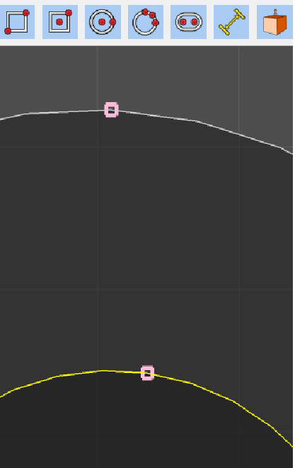

* Create a hole in a solid, try and create a face on a curved face. No error is presented to the user. 
* For curved surfaces, snapping needs to be computed at runtime, annotate snapping on actual curve and apply results. 
* Subdivision for shapes should be based on zoom or dist of object to camera. 
* Shp list should have a field for selected, and the field should reflect what is selected in the viewer.
* Extrude should be in projection mode.
* Create sketch from face needs a temporary face select mode. When mode is changed it should go back to the previous mode. Other tools like chamfer need to do this also.
* Add sketch node should have the ability to allow the user to specify placement distance from another node.
* Ability to show/hide sketch nodes

* For selection mode, not all of the current modes are useful.
* Sketches should be hidden in:
  * Chamfer mode
  * Inspection mode
  * Move mode(Might want for snapping purposes)
  * Rotate mode
  * Scale mode
* Add concept of dim or dimension, use with node, a measurement, but does not participate in generating faces. 