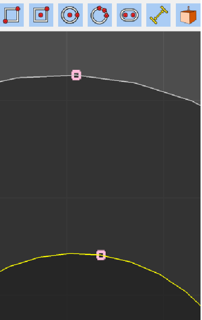

# Known Bugs and Issues

* All operational axes must be persisted.
* Create a hole in a solid, try and create a face on a curved face. No error is presented to the user. 
* For curved surfaces, snapping needs to be computed at runtime, annotate snapping on actual curve and apply results. 
* Subdivision for shapes should be based on zoom or dist of object to camera. 
* Shp list should have a field for selected, and the field should reflect what is selected in the viewer.
* Extrude should be in projection mode.
* Create sketch from face needs a temporary face select mode. When mode is changed it should go back to the previous mode. Other tools like chamfer need to do this also.
* Add sketch node should have the ability to allow the user to specify placement distance from another node.
* Ability to show/hide sketch nodes
* Underlay calibration ("Set X from edge..." / "Set Y from edge...") can (and frequently does) introduce shear because the picks are measured against the basis present at click time. Full affine support exists (6-DOF editor + raw distortion toggle + per-axis flips for corner mapping), and both axes now auto-apply "Make orthogonal (keep lengths + U)" on completion. The "Define underlay datum..." tool that forced a clean perpendicular V has been removed. Rough edges that remain:
  - The raw 6-DOF editor exposes low-level numbers (Base + U/V) rather than higher-level controls (e.g. a direct shear-angle slider).
  - In raw mode you sometimes need the "Reverse image U/V" flips to get source (0,0) at the exact parallelogram corner you expect (due to OCCT face parametrization on sheared quads created from a wire).
  - The two render paths (default "preserve" resampling vs. raw/direct) have deliberately different visual results for the same affine; this can be surprising until you understand the toggle.
  - Calibration always affects the *entire* source image; there is no built-in crop/region-of-interest inside the underlay itself.
  - The cyan frame always shows the precise current full-image parallelogram (never a simple rectangle once shear exists).

* For selection mode, not all of the current modes are useful.
* Scale mode broken.
* Add concept of dim or dimension, use with node, a measurement, but does not participate in generating faces.
* Vendor and commit `third_party/ImGuiColorTextEdit/` into this repository; it has not been maintained upstream for a long time and we should pin a known-good copy.
* ~~After an edge is split by its midpoint, the split edges do not have midpoints to snap to~~ - FIXED 
* Operation axis, after adding undo does not work correctly.
* Add rectangle two points, with angle constraint, preview does not honor it.
* Add rectangle with center point behaves like the two point version.
* Add circle from three points is broken.
* For slot tool, there is no need for the second edge to have a angle constraint.
* If the exact same arc circle or edge is added twice, unneeded edges are added. The mirror tool does this.
* Need a option to specify circle by diameter. 
* Need a mirror option for edge. First specify center.
* ~Need a option to not add edge midpoint nodes.~
* Need a option to split a edge.
* If the operational axis is defined. Do not render snap points and perminate nodes.
* Need a hotkey for face inspection mode.
* Dist and angle input should accept basic algeraic functions, e.g. /, +, etc
