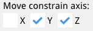

# EzyCad Usage Guide

## Table of Contents
1.  [Introduction](#introduction)
2.  [Getting Started](#getting-started)
3.  [User Interface](#user-interface)
4.  [File Operations](#file-operations)
5.  [Edit Operations](#edit-operations)
6.  [Modeling Tools](#modeling-tools)
7.  [Hotkeys](#hotkeys)
8.  [View Controls](#view-controls)
9.  [3D viewer (Open CASCADE)](usage-occt-view.md)
10. [Tips and Tricks](#tips-and-tricks)
11. [Support](#support)
12. [Tool Icons](#tool-icons)
13. [Settings](usage-settings.md)
14. [Scripting](#scripting-lua-and-python)

## Introduction

EzyCad (Easy CAD) is an open-source CAD application for hobbyist machinists to design and edit 2D and 3D models for machining projects. It supports creating precise parts with tools for sketching, extruding, and applying geometric operations, using OpenGL, Dear ImGui, and Open CASCADE Technology (OCCT). You can exchange geometry with other CAD tools, CAM, or 3D printing using **STEP**, **IGES**, **STL**, and **PLY**.

**Source:** [github.com/trailcode/EzyCad](https://github.com/trailcode/EzyCad) · **Project home:** [trailcode.github.io/EzyCad](https://trailcode.github.io/EzyCad/)

> **EzyCad** (with a **y**) is mechanical CAD — not EZCAD2/EZCAD3 laser marking software.

## Getting Started

### System Requirements
- **Windows** (desktop), or **[WebAssembly](https://trailcode.github.io/EzyCad/EzyCad.html)** ([project home](https://trailcode.github.io/EzyCad/))
   - Not tested: Linux or macOS desktop builds
- OpenGL-compatible graphics card

### Installation
1. Download the latest release for your operating system - see [README](README.md) for build instructions; automated builds and releases are not yet available
2. Extract the archive to your preferred location
3. Run the executable file

## User Interface

### Main Components
1. **Menu Bar**
   - **File** - [New](#new-project), [Open](#open-project), [Save](#save-project), Save as, [Project units](#project-units), [Import](#importing-3d-geometries), [Export](#exporting-3d-geometries), Examples, Exit
   - **Edit** - [Undo](#edit-operations), [Redo](#edit-operations)
   - **View** - [Settings, panes, Lua/Python consoles](usage-settings.md#view-menu)
   - **Help** - [About](#help-menu), [Usage Guide](#help-menu), and the separate **[Settings guide](usage-settings.md)**

2. **Toolbar**
   - Quick access to commonly used tools
   - Mode selection buttons
   - Operation tools

3. **Sketch List**
   - [View and manage 2D sketches](#sketch-list)
   - [Select and edit sketch elements](#sketch-list)
   - [Toggle sketch visibility](#sketch-list)
   - [Sketch origin (permanent + reference point per sketch)](usage-sketch.md#sketch-origin)

4. **Shape List**
   - [List 3D solids, materials, and display options](#shape-list)
   - [Inspect shape topology and properties](#shape-info)

5. **Options Panel**
   - The top of the panel always shows the name of the current tool/mode (matching the toolbar tooltip), followed immediately by a small **"?"** button. Clicking the "?" opens the online user guide directly to the section describing that specific tool (contextual help; see the per-mode links in the source `get_doc_url_for_mode` map).
   - Related controls are grouped by headings (for example **Sketch options**, **Extrude**, **Selection**, **Material**, **Polar duplicate**), depending on the active tool.
   - In non-sketch modes the Options panel shows **Selection** (in Normal/Inspection), tool-specific controls, **Orthographic projection** (toggles the camera mode, and **Material**. Sketch modes force orthographic projection and show sketch-specific options instead. **Face extrude** reads the same preset in its Options **Material** row.
   - To change material on a solid already in the scene, use the [Shape List](#shape-list).
   - **Move**, **Rotate**, and **Scale**: transform options only (no material row there).
   - Sketch-related options (snap, length dimension placement, face extrude, shortcuts) are summarized in **[usage-settings.md](usage-settings.md#options-panel)**.

6. **Log Window**
   - View operation history
   - Check for errors and warnings
   - Monitor system status

### Help menu

- **About** - Opens the [project README](README.md) in the browser.
- **Usage Guide** - Opens the [online usage guide](https://ezycad.readthedocs.io/en/latest/usage.html) (Read the Docs; source is [usage.md](usage.md) in this repository).

For **View** (Settings, pane toggles, consoles), saving preferences, and the **Settings** pane sections, see **[usage-settings.md](usage-settings.md)**. For **Options** panel details by mode, see **[Options panel](usage-settings.md#options-panel)**.

### Sketch List

The **Sketch List** pane lists all 2D sketches in the current document. Open it from **View -> Sketch List**.

Each row is laid out left to right:

- **Expand** - Click **`>`** / **`v`** to show or hide details for that sketch (tooltip *Expand details* / *Collapse details*).
- **Set current** - Radio button (circle). The current sketch is used for editing and for operations such as [extrude](#extrude-sketch-face-tool-e). If you are not already in a sketch tool or sketch inspection mode, choosing a sketch also switches to **Sketch inspection mode**; otherwise the active sketch tool stays selected (for example **Add line** remains active when you change sketches).
- **Rename** - Click the name field and type a new name.
- **Visibility** - Checkbox to show or hide the sketch in the 3D view.
- **Underlay** - Checkbox to show or hide an [image underlay](usage-sketch.md#image-underlay) when one is imported (disabled until an underlay exists; tooltip *Display underlay*).
- **Sketch properties** - **`[P]`** opens **Sketch properties** (sketch **Origin** X/Y, import/remove underlay, calibration, transform). See [Sketch origin](usage-sketch.md#sketch-origin) and [Image underlay](usage-sketch.md#image-underlay).
- **Delete** - Right-click the name and choose **Delete**.

When expanded, the row shows:

- **Dimensions** - Table of length dimensions: visibility, editable name, and **offset** (label distance from the edge; **0** = automatic). Hovering a row highlights that dimension in the 3D view (color from **Settings -> View presentation -> Element hover color**).
- **Nodes**, **Edges**, **Faces** - Collapsible lists of element labels for inspection. **Nodes** lists the sketch **Origin** (always present; see [Sketch origin](usage-sketch.md#sketch-origin)) plus **user-placed** points from the Add node tool (the ones with **+** markers in sketch mode). It does not list every internal topology vertex or automatic edge midpoint. **Edges** and **Faces** use default labels (`E0`, `F0`, ...) or saved names where set. Dimension names are editable in the table above; node/edge names in these lists are read-only labels for reference. Hovering a **Nodes**, **Edges**, or **Faces** row highlights that element in the 3D view (face fill from **Settings -> Sketch -> Face highlight fill**, edges from **Edge highlight**, nodes from **Element hover color**), including outside sketch modes when sketch geometry is otherwise hidden; highlights draw above 3D solids so extruded shapes do not cover them. Each **Faces** row has an **`E`** button (tooltip *Extrude this face*) and a right-click **Extrude** menu item that enter [extrude mode](#extrude-sketch-face-tool-e) for that face (set the sketch current, then drag height in the 3D view).

Which sketches are expanded, which subsections (**Dimensions**, **Nodes**, **Edges**, **Faces**) are open, and the list scroll position are stored in the project `.ezy` file and restored when you reopen the project.

The window can be closed with its close button; use **View -> Sketch List** again to show it.

### Shape List

The **Shape List** pane lists every **3D shape** and **group** in the current document (extrudes, imports, booleans, etc.). Open it from **View -> Shape List**.

At the top:

- **Hide all** - When checked, hides every solid in the 3D view without changing each row's visibility checkbox; when cleared, solids return to their previous per-row visibility (and group visibility).
- **New group** - Creates an empty organizational group under the **current group** (document root when none is set) and makes it current.
- **Group** - Places the currently selected solids under a new group (enabled when one or more solids are selected in the 3D view) and makes that group current.

Shapes form a parent/child outliner. Groups are folders only (they do not move children when transformed). Drag a row onto a group to reparent it, onto a solid to place it under that solid's parent, or into the empty space below the list to move it to the document root.

Click a **group** (including an empty one) to make it the **current group**. Click a solid to select it and set the current group to that solid's parent. New primitives, extrudes, revolves, and similar additions go into the current group.

Each row (left to right):

- **Visibility** - Checkbox to show or hide that node. Hiding a **group** hides its whole subtree in the 3D view.
- **Solid / wire** - Checkbox (solids only) to switch **shaded** or **wireframe**.
- **M** - Solids only: material popup; right-click for **Shape info...** or **Delete**.
- **Name** - Expandable tree row with an editable name. Click the row to select that solid (or all descendant solids for a group) and update the current group. **Ctrl+click** toggles multi-select. Drag to reparent (empty area below the list = document root).
- **Right-click the name** - Solids: **Shape info...** / **Delete**. Groups: **Ungroup** (moves **all** direct children to the group's parent, then removes the group) / **Delete** (cascade-deletes the whole subtree).

Boolean results stay under the shared parent of their inputs when all inputs share one parent; otherwise they are placed at the document root. **File -> Import** STEP assemblies preserve product/assembly groups in the tree (unless **Union shapes** is checked).

The **current group** and rows that match the **current 3D selection** use a highlighted full-row style. Hovering a visible solid row also highlights that shape in the 3D view (**Settings -> View presentation -> Element hover color**).

The window can be closed with its close button; use **View -> Shape List** again to show it.

#### Shape info

Right-click a shape **name** or the **M** button in the Shape List and choose **Shape info...** to open a property dialog for that 3D shape. Use **Refresh** to recompute the values after the geometry changes.

The dialog reports document fields (name, material, shaded vs wireframe display, visibility) and Open CASCADE (OCCT) topology and measurements, including:

| Category            | Examples                                                                                                                                         |
| ------------------- | ------------------------------------------------------------------------------------------------------------------------------------------------ |
| **Topology**        | Root type (Solid, Shell, Face, Compound, etc.), validity, whether the shape has a location transform, closed-shell flag when the root is a shell |
| **Counts**          | Compounds, CompSolids, Solids, Shells, Faces, Wires, Edges, Vertices (nested sub-shapes included)                                                |
| **Bounds**          | Axis-aligned bounding box min/max and overall size                                                                                               |
| **Mass properties** | Volume and center of mass (when the shape encloses volume), surface area, length (for wire-like geometry)                                        |

This is useful after **Revolve**, **Extrude**, booleans, or imports when you need to confirm whether a result is a closed **Solid** or an open **Shell** / surface, or to check face and edge counts and overall size. The dialog closes automatically if the shape is deleted from the document.

## File Operations

### Supported Formats
- Native format: `.ezy` files (ZIP archives)
- [Import formats: STEP (`.step`, `.stp`), PLY (`.ply`)](#importing-3d-geometries)
- [Export formats: STEP, IGES, STL (binary), PLY (binary)](#exporting-3d-geometries)

### Basic Operations
1. #### New Project
   - Start with a clean workspace (default XY sketch)
   - Apply **Settings -> New project defaults** (**Project units**, **Default 2D view width** / **height**)
   - Reset the camera to a **top view** framed to those width/height values

2. #### Open Project
   - Load existing `.ezy` files

3. #### Save Project
   - Save current work to `.ezy` file (includes `projectUnit`)

4. #### Project units
   - **File -> Project units -> Inches** or **Millimeters** sets how sketch lengths, dimensions, Tab distance entry, grid Settings fields, and related length inputs are shown and typed for the **open** project
   - Changing units does **not** rescale stored geometry; a length that was **1** inch becomes **25.4** mm in the UI
   - Stored in the `.ezy` manifest as `projectUnit` (`inch` or `millimeter`); older files without the field load as **Inches**
   - Default for **File -> New** comes from **Settings -> New project defaults -> Project units**
   - Independent of **File -> Export** units (export still asks separately)

5. **Import/Export**
   - [Import STEP or PLY](#importing-3d-geometries)
   - [Export to STEP, IGES, binary STL, or binary PLY](#exporting-3d-geometries)

### Startup project (defaults)

EzyCad can load a **default document** when it starts (geometry, camera, tool mode). See **[Startup project](usage-settings.md#startup-project)** in the settings guide.

## Edit Operations

Edit operations change your model (sketches or 3D shapes) and can be navigated with undo/redo.

- **Delete selected**
  - Use <kbd>Shift</kbd>+<kbd>D</kbd>, <kbd>Delete</kbd>, or <kbd>Backspace</kbd> to remove the currently selected sketch elements or shapes.
  - Deletions are recorded in the undo history and can be undone/redone.

- **Undo and Redo**

  EzyCad includes document-level undo/redo for both sketches and 3D shapes.

  - **What it does**
    - Tracks modeling operations as steps in a history stack (sketch edits, [extrudes](#extrude-sketch-face-tool-e), [boolean operations](#boolean-operations), [transforms](#3d-modeling), etc.).
    - Undo/redo restores the **model state only**; the 3D view (camera) is intentionally not changed so you can review changes from a consistent perspective.
    - When you undo or redo a step, the application returns to the mode that was active for that operation (e.g., sketch inspection vs normal inspection).

  - **Shortcuts**
    - <kbd>Ctrl</kbd>+<kbd>Z</kbd> - Undo last operation.
    - <kbd>Ctrl</kbd>+<kbd>Y</kbd> or <kbd>Ctrl</kbd>+<kbd>Shift</kbd>+<kbd>Z</kbd> - Redo.
    - These shortcuts work even when focus is in a pane such as Sketch List, Options, or Log.

  - **Limits and notes**
    - The history keeps a fixed number of recent steps (currently 50).

### Cancel current operation (Esc)

Press <kbd>Esc</kbd> to cancel the current action or step back to a broader mode.

- **If something is in progress:** <kbd>Esc</kbd> cancels it and discards the change. Examples: cancel a line you are drawing, revert an unconfirmed [move](#shape-move-tool-g)/[rotate](#shape-rotate-tool-r)/[scale](#shape-scale-tool-s), cancel [extrude](#extrude-sketch-face-tool-e) preview, clear the distance or angle input dialog.
- **If nothing is in progress:** <kbd>Esc</kbd> steps the application to the **parent mode** (one level up):
  - From a **sketch tool** (e.g. Add line, Add circle, Operation axis) -> **Sketch inspection mode**.
  - From **Sketch inspection**, **Normal**, or any **shape tool** ([Move](#shape-move-tool-g), [Rotate](#shape-rotate-tool-r), [Scale](#shape-scale-tool-s), [Extrude](#extrude-sketch-face-tool-e), [Chamfer](#other-feature-operations) (<kbd>C</kbd>), [Fillet](#other-feature-operations) (<kbd>F</kbd>), [Polar duplicate](#shape-polar-duplicate-tool), [Create sketch from face](usage-sketch.md#create-sketch-from-planar-face-tool)) -> **Normal** (inspection) mode.

So repeated <kbd>Esc</kbd> from a sketch drawing tool first cancels the current element, then returns to Sketch inspection, then to Normal.

## Modeling Tools

EzyCad uses a workflow-based approach to 3D modeling: start with 2D sketches, then transform them into 3D shapes using feature operations. This section covers both the sketching tools for creating 2D geometry and the 3D modeling tools for working with solid shapes.

### Workflow: From 2D Sketches to 3D Shapes

The typical modeling workflow in EzyCad follows these steps:

1. **Create a 2D Sketch**: Use the [2D Sketching tools](usage-sketch.md) to draw 2D geometry on a reference plane (`XY`, `XZ`, or `YZ`). Sketches consist of edges (lines, arcs, circles) that form closed shapes called faces. Every new sketch also gets a built-in **[Origin](usage-sketch.md#sketch-origin)** — a permanent **+** reference point at `(0, 0)` on the plane.

2. **Extrude the Sketch**: Use the [Extrude tool](#extrude-sketch-face-tool-e) to convert 2D sketch faces into 3D solid shapes by extending them perpendicular to the sketch plane.

3. **Create a Sketch from a Planar Face**: Once you have 3D shapes, use [Create sketch from planar face](usage-sketch.md#create-sketch-from-planar-face-tool) to pick a flat face on a solid. EzyCad extracts the face boundary into a new sketch aligned with that face (Origin at the face bounding-box center). Edit the sketch, then extrude again to add or cut features on the existing model.

4. **Modify 3D Shapes**: Use [3D Modeling tools](#3d-modeling) to transform shapes ([move](#shape-move-tool-g), [rotate](#shape-rotate-tool-r), [scale](#shape-scale-tool-s)) or create patterns ([polar duplicate](#shape-polar-duplicate-tool)).

5. **Apply Feature Operations**: Use [boolean operations](#boolean-operations) (cut, fuse, common) or edge-based feature operations (chamfer with <kbd>C</kbd>, fillet with <kbd>F</kbd>) to refine your 3D model.

**Key Concepts:**

|                             |                                                                                                                                                 |
| --------------------------: | ----------------------------------------------------------------------------------------------------------------------------------------------- |
| **Sketches**                | 2D drawings on a plane that define the profile of your 3D shape                                                                                 |
| **Origin**                  | One permanent **+** reference node per sketch ([details](usage-sketch.md#sketch-origin)); snap target; listed as **Origin** in the Sketch List  |
| **Faces**                   | Closed regions within a sketch that can be [extruded](#extrude-sketch-face-tool-e) into 3D                                                      |
| **Sketch from planar face** | New sketch whose plane and boundary come from a flat face on an existing 3D shape ([tool](usage-sketch.md#create-sketch-from-planar-face-tool)) |
| **Shapes**                  | 3D solid objects created from extruded sketch faces                                                                                             |
| **Feature Operations**      | Transform sketches into 3D geometry or modify existing 3D shapes                                                                                |

### Import dialog

**File -> Import** opens an **Import** window for STEP or PLY. Review metadata, optionally enable **Union shapes** (STEP), then click **Import into project**. The window closes after a successful import.

| Format                     | What the Import dialog shows                              |
| -------------------------- | --------------------------------------------------------- |
| **STEP** (`.step`, `.stp`) | Roots/shapes, import bodies, named bodies, topology, bbox |
| **PLY** (`.ply`)           | Encoding, vertex and face counts from the header          |

**How to use:**
1. Choose **File -> Import**
2. Pick a `.step`, `.stp`, or `.ply` file
3. Review the label/value table; for STEP, optionally enable **Union shapes**
4. Click **Import into project**

For in-document topology of an already-loaded solid, use [Shape info](#shape-info) from the Shape List.

### Importing 3D Geometries

In addition to creating 3D shapes from sketches, EzyCad supports importing existing 3D geometry from external CAD files. This allows you to:

|                                |                                                  |
| -----------------------------: | ------------------------------------------------ |
| **Work with existing designs** | Import models created in other CAD software      |
| **Combine workflows**          | Use imported geometry alongside sketched shapes  |
| **Modify imported models**     | Apply EzyCad's modeling tools to imported shapes |

**Supported import formats:**

|                            |                                                               |
| -------------------------: | ------------------------------------------------------------- |
| **STEP** (`.step`, `.stp`) | Precise B-rep (boundary representation) CAD exchange          |
| **PLY** (`.ply`)           | Triangle mesh; fast to load compared to heavy STEP assemblies |

**How to import:**
1. Use **File -> Import**
2. Pick a `.step`, `.stp`, or `.ply` file
3. Review metadata in the [Import dialog](#import-dialog); for STEP assemblies, optionally check **Union shapes**
4. Click **Import into project** - geometry is added as 3D shape(s) in the document, scaled to project units (see below)
5. You can move, rotate, scale, and use imported bodies in [boolean operations](#boolean-operations) like native solids where the geometry allows it

**Units:** Sketch and display lengths follow **File -> Project units** (**Inches** or **Millimeters**). Internal model coordinates stay inch-scaled (`model = inches * dimension_scale`, default **100**). Changing project units only remaps the UI; it does not rewrite geometry. Import scaling:

| Format                     | File units                                                             | Into EzyCad                                   |
| -------------------------- | ---------------------------------------------------------------------- | --------------------------------------------- |
| **STEP** (`.step`, `.stp`) | Declared in the file (often mm); OCCT reads them as mm, then converted | Scaled so lengths match the inch-scaled model |
| **PLY** (`.ply`)           | No standard unit metadata                                              | Vertex coords are treated as **inches**       |

**PLY import notes:**
- Supported: **ASCII** PLY and **binary little-endian** PLY.
- Not supported: **binary big-endian** PLY.
- Meshes must use **triangular faces** (3 indices per face). Typical `vertex` properties **x**, **y**, **z** (and optional extra properties) are accepted; **face** elements must include a **list** property (e.g. `property list uchar int vertex_indices`) suitable for triangles.
- Imported PLY data becomes a **mesh-style** solid (many triangular faces), not a parametric STEP solid - file size and display performance depend on triangle count.

**STEP import notes:**
- If the file cannot be read or contains no transferable geometry, a **message** explains the failure (invalid data, empty transfer, etc.).
- Assemblies often arrive with XCAF product structure. Import builds Shape List **groups** for assemblies and leaf solids for bodies (unless **Union shapes** merges everything into one solid). The Import dialog **Import bodies** count shows how many leaf solids will be added.
- When the STEP file includes product or part names, those names appear in the Shape List (duplicate names get `.001`, `.002`, ...). Unnamed bodies stay as `Shape`.
- **Union shapes** (Import dialog) fuses those bodies into one solid before adding to the document. If union fails, the import is aborted and nothing is added.

**Note:** **IGES** and **STL** are available for **export** only, not import.

### Exporting 3D geometries

Use **File -> Export** to save the current model for other CAD tools, CAM, or 3D printing.

|                    |                                                                      |
| -----------------: | -------------------------------------------------------------------- |
| **STEP** (`.step`) | Precise B-rep exchange                                               |
| **IGES** (`.igs`)  | Legacy CAD exchange                                                  |
| **STL**            | Triangle mesh; files are written in **binary** form                  |
| **PLY** (`.ply`)   | Triangle mesh in **binary little-endian** PLY (tessellated like STL) |

**Scope:** Export includes only **document 3D shapes** (Shape List solids), not sketch edges or faces. If one or more 3D shapes are selected in the viewer, only those shapes are exported (with their current move/rotate/scale applied). Selected sketch elements are ignored. If no 3D shapes are selected, all document shapes are exported together.

**Units:** After you choose a format, an **Export units** dialog asks for **Inches** or **Millimeters** (defaults: millimeters for STEP/IGES, inches for STL/PLY).

| Format              | How units are applied                                                      |
| ------------------- | -------------------------------------------------------------------------- |
| **STEP** / **IGES** | Geometry scaled to the chosen unit; that unit is written into the CAD file |
| **STL** / **PLY**   | Geometry scaled to the chosen unit; files have **no** unit metadata        |

**Mesh exports (STL and PLY):** Surfaces are **tessellated** with a fixed linear deflection (same idea as typical STL export). Very complex B-rep models produce large mesh files.

**How to export:** **File -> Export ->** choose STEP, IGES, STL (binary), or **PLY (binary)**, pick **Inches** or **Millimeters**, then pick a save location (desktop) or accept the browser download (WebAssembly).

For detailed information on creating 2D geometry, see the [2D Sketching](usage-sketch.md) guide. For information on working with 3D shapes, see the [3D Modeling](#3d-modeling) section.

### 2D Sketching

#### Sketch origin (permanent reference point)

Every sketch has exactly one **Origin**: a fixed point on the sketch plane, shown as a **+ inside a circle** on the **active sketch only** in sketch mode (distinct from red **+** [Add node](usage-sketch.md#add-node-tool) markers on visible sketches; you cannot delete the Origin).

|                             |                                                                                                                      |
| --------------------------: | -------------------------------------------------------------------------------------------------------------------- |
| **Reference-plane sketch**  | Origin at plane coordinates **(0, 0)**.                                                                              |
| **Sketch from planar face** | Origin at the **bounding-box center** of the extracted face boundary.                                                |
| **Sketch List**             | Listed as **Origin** under **Nodes** when you expand a sketch row.                                                   |
| **Sketch properties**       | **[P]** on the sketch row: **Show origin marker**, **Position** sliders with **Set**, for typed values.              |
| **Snapping**                | Full vertex and axis snap when the marker is shown; other visible sketches' origins snap when their marker is shown. |

Full details (marker size, operational-axis visibility, tips): **[Sketch origin](usage-sketch.md#sketch-origin)** in the 2D sketching guide.

See the **[2D Sketching guide](usage-sketch.md)** for full documentation of sketch tools: **[sketch origin](usage-sketch.md#sketch-origin)** (one permanent **+** reference point per sketch), **add node** (points and edge splits), line and multi-line edges, circles, arcs, rectangles, squares, slots, **operation axis** (with Mirror and Revolve actions in the Options panel), edge dimensions, and creating a sketch from a planar face. Revolve (via an operation axis) is one way to generate 3D solids directly from sketch geometry.

**Sketch snap (overview):** While drawing or using **Add node**, picks can snap to existing geometry within **Snap dist** (Options panel), unless **Snap guide mode** is *None*. The main behaviors:

|                    |                                                                                                                                                                                                               |
| -----------------: | ------------------------------------------------------------------------------------------------------------------------------------------------------------------------------------------------------------- |
| **Vertex snap**    | Lock to an existing corner when horizontal and vertical axis guides both align to the same point.                                                                                                             |
| **Sketch origin**  | Every sketch's built-in **Origin** is a snap target when its marker is shown (see [Sketch origin](usage-sketch.md#sketch-origin)).                                                                            |
| **Mid-point snap** | With **Add node**, a click near a **straight** edge (but not at its ends) snaps onto the segment; EzyCad places a new vertex there and **splits** the edge into two. You do not need to hit the line exactly. |
| **Edge midpoint**  | Straight edges often expose a geometric **midpoint** as a snap target while drawing; that is separate from mid-point snap and from user-placed **+** nodes.                                                   |

More detail: [Sketch snapping](usage-sketch.md#sketch-snapping) in the sketch guide.

### 3D Modeling
1. **Transform Operations**
   -  [Move shapes (G)](#shape-move-tool-g)
   -  [Rotate objects (R)](#shape-rotate-tool-r)
   -  [Scale elements (S)](#shape-scale-tool)
   -  [Polar duplicate](#shape-polar-duplicate-tool)
   -  [Preview a local-plane cross-section](#shape-cross-section-tool)

#### Shape Move Tool (G)

The shape move tool allows you to reposition selected shapes in the 3D viewer with precision and flexibility.

**Features:**

|                                  |                                                                                                                                         |
| -------------------------------: | --------------------------------------------------------------------------------------------------------------------------------------- |
| **Axis Constraints**             | Restrict movement to the X, Y, or Z axis by toggling axis constraints in the options panel or using keyboard shortcuts.                 |
| **Interactive Distance Editing** | Enter or adjust the distance moved along each axis for precise control. Real-time feedback is provided in the viewer and options panel. |
| **Improved Plane Handling**      | The move plane is automatically estimated based on the center of the selected shapes, making movement more intuitive.                   |
| **Finalization Logic**           | The move operation completes when you confirm the action (e.g., <kbd>left mouse button</kbd>).                                          |
| **Reset and Cancel**             | Press <kbd>Esc</kbd> to cancel and revert to the original position at any time during the move operation.                               |

**How to Use:**
1.  **Activate Move Tool:** Select one or more shapes and press <kbd>G</kbd> or click the icon.
2. **Constrain Movement (Optional):** Use the options panel to lock movement to a specific axis, or use keyboard shortcuts (e.g., <kbd>X</kbd>, <kbd>Y</kbd>, <kbd>Z</kbd>).

   
   
   *Example: Movement constrained on the Y and Z axes.*
3. **Edit Distance (Optional):**  
While moving a shape, you can press <kbd>Tab</kbd> to activate a floating distance input box for the current axis. If no axis constraints are set, you can edit distances for X, Y, and Z in sequence. If axis constraints are enabled, only the allowed axes are available for editing. After entering a distance, that axis is locked to the specified value. Pressing <kbd>Tab</kbd> again advances to the next available axis. After the distances for all participating axises are defined, the more will be finalized.

4. **Finalize or Cancel:** Press the <kbd>left mouse button</kbd> to confirm and apply the move, or <kbd>Esc</kbd> to cancel and revert.

**Tips:**
- Use axis constraints for straight-line moves.
- Use interactive distance editing for precise adjustments.
- You can always cancel and try again if the move isn't as expected.

#### Shape Rotate Tool (R)

The shape rotate tool enables precise rotation of selected shapes around a specified axis in the 3D viewer.

**Features:**

|                               |                                                                                                  |
| ----------------------------: | ------------------------------------------------------------------------------------------------ |
| **Rotation Axis Options**     | Choose between view-to-object rotation or constrain rotation to X, Y, or Z axis.                 |
| **Interactive Angle Editing** | Enter or adjust the rotation angle for precise control with real-time preview.                   |
| **Visual Feedback**           | The rotation axis is displayed with color-coded indicators (Red for X, Green for Y, Blue for Z). |

**How to Use:**
1. **Activate Rotate Tool:**  Select one or more shapes and press <kbd>R</kbd> or click the icon. You can also activate the tool and select the shape(s) to rotate afterwards.
2. **Select Rotation Axis: (Optional)**
   
   

   *Example: Rotation around on the X axis.*
   - Press <kbd>X</kbd> to rotate around the X-axis (Red)
   - Press <kbd>Y</kbd> to rotate around the Y-axis (Green)
   - Press <kbd>Z</kbd> to rotate around the Z-axis (Blue)
   - Press the same axis key again to switch to view-to-object rotation

3. **Edit Angle (Optional):**
   - Press <kbd>Tab</kbd> to activate the angle input box
   - Enter the desired rotation angle in degrees
   - The preview updates in real-time as you adjust the angle
   - Pressing enter finializes the rotation

4. **Finalize or Cancel:**
   - Press the <kbd>left mouse button</kbd> to confirm and apply the rotation
   - Press <kbd>Esc</kbd> to cancel and revert to the original position

**Tips:**
- Use view-to-object rotation for intuitive free-form rotation
- Use axis constraints for precise rotations around specific axes
- The rotation center point is displayed as a red dot for reference
   - Visible in wirefame rendering of the shape(s)
- You can combine rotation with other operations for complex transformations

#### Shape Scale Tool (S)

The shape scale tool allows you to uniformly scale selected shapes around a computed center point.

**Features:**

|                                |                                                                                                                                  |
| -----------------------------: | -------------------------------------------------------------------------------------------------------------------------------- |
| **Automatic center detection** | The scale center is estimated from the bounding box center of the selected shapes.                                               |
| **Screen-plane scaling**       | Scaling happens in a plane derived from the current view, making the interaction intuitive.                                      |
| **Interactive preview**        | Moving the mouse adjusts the scale factor and updates the shapes in real time.                                                   |
| **Safe bounds**                | The scale factor is clamped to a reasonable range (e.g., between very small and very large values) to avoid degenerate geometry. |

**How to Use:**

1. **Select shapes:** Select one or more shapes in the 3D view or Shape List.
2.  **Activate Scale Tool:** Click the *Shape scale* icon in the toolbar (or choose Scale from the Edit/Transform area if present).  
3. **Move the mouse:**  
   - The tool computes a scale center and a view-aligned plane.  
   - Moving the mouse away from or toward the center changes the scale factor and previews the scaled result.
4. **Finalize:** Confirm the operation (e.g., by clicking to complete the interaction) to apply the scale permanently.
5. **Cancel:** Press <kbd>Esc</kbd> to cancel and revert to the original shape sizes.

**Tips:**

- Scale works best when the view direction makes the movement relative to the center easy to see (avoid looking exactly edge-on at the objects).
- Because the operation is undoable, you can experiment with different scale amounts and step back with <kbd>Ctrl</kbd>+<kbd>Z</kbd> if needed.

## Feature Operations

### Extrude Sketch Face Tool (E)

The extrude tool allows you to create 3D solid shapes by extruding 2D sketch faces along a direction perpendicular to the sketch plane.

**Features:**

|                                  |                                                                                                                                                            |
| -------------------------------: | ---------------------------------------------------------------------------------------------------------------------------------------------------------- |
| **Orthographic camera**          | Extrude mode forces **orthographic** projection (same as other sketch tools) so extrusion height is easier to judge without perspective foreshortening     |
| **Direct face selection**        | Click directly on a sketch face to select it for extrusion, or use **`E`** / right-click **Extrude** on a face in the [Sketch List](#sketch-list)          |
| **Automatic view adjustment**    | The view automatically rotates if the face plane is parallel to the view plane (within 5 degrees), providing better visibility for the extrusion operation |
| **Real-time preview**            | See the extruded shape update in real-time as you move the mouse                                                                                           |
| **Interactive distance control** | Drag the mouse to adjust extrusion distance, or use the distance input dialog (<kbd>Tab</kbd> key) for precise control                                     |
| **Distance annotation**          | A dimension annotation displays the current extrusion distance                                                                                             |
| **Bidirectional extrusion**      | The extrusion direction is determined by which side of the face plane you move the mouse to                                                                |

**How to Use:**
1.  **Activate Extrude Tool**: Press <kbd>E</kbd> or click the icon to enter extrude mode
2. **Select Face**: Click on a sketch face that you want to extrude, **or** in the [Sketch List](#sketch-list) expand the sketch, open **Faces**, and use **`E`** or right-click **Extrude** on that face row
   - The face must be part of a closed sketch (forming a valid face)
   - The system will automatically select the face closest to the camera if multiple faces overlap (3D click only)
3. **Adjust Extrusion Distance**:
   - **Mouse drag**: Move the mouse to adjust the extrusion distance in real-time
   - **Precise input**: Press <kbd>Tab</kbd> to open the distance input dialog and enter an exact extrusion distance
   - The distance annotation shows the current extrusion distance
4. **Finalize**: Click the <kbd>left mouse button</kbd> to confirm and create the extruded shape
5. **Cancel**: Press <kbd>Esc</kbd> at any time to cancel the extrusion operation

**Keyboard Shortcuts:**

|                  |                                                           |
| ---------------: | --------------------------------------------------------- |
| <kbd>E</kbd>     | Activate extrude mode                                     |
| <kbd>Tab</kbd>   | Open distance input dialog for precise extrusion distance |
| <kbd>Esc</kbd>   | Cancel current extrusion operation                        |
| <kbd>Enter</kbd> | Finalize extrusion (when using distance input)            |

**Tips:**
- Extrude uses an **orthographic** camera (projection mode). Perspective from Normal mode is restored when you leave Extrude.
- Extrude works best when the view is not directly parallel to the sketch plane - the system will automatically rotate the view if needed
- Use the distance input dialog for precise measurements
- The extrusion direction depends on which side of the face plane you move the mouse to
- Multiple faces from the same sketch can be extruded separately
- Extruded shapes can be used in [boolean operations](#boolean-operations) (cut, fuse, common)

**Common Use Cases:**

|                       |                                                                                                |
| --------------------: | ---------------------------------------------------------------------------------------------- |
| **Extrusion**         | Select the circle face and [extrude](#extrude-sketch-face-tool-e) to create cylindrical shapes |
| **Base features**     | Create the base feature of a part by [extruding](#extrude-sketch-face-tool-e) a profile        |
| **Additive features** | [Extrude](#extrude-sketch-face-tool-e) additional features on existing parts                   |
| **Through features**  | Extrude holes or cutouts by using the [Cut](#boolean-operations) operation after extrusion     |

#### Shape Polar Duplicate Tool

The polar duplicate tool allows you to create multiple copies of selected shapes arranged in a circular pattern around a rotation center point.

**Features:**

|                          |                                                                                 |
| -----------------------: | ------------------------------------------------------------------------------- |
| **Circular array**       | Creates multiple copies of shapes arranged in a circular pattern                |
| **Configurable angle**   | Set the total angle for the pattern (default: 360 degrees)                      |
| **Configurable count**   | Set the number of duplicate elements to create (default: 5)                     |
| **Rotation option**      | Choose whether duplicates are rotated as they're copied (default: enabled)      |
| **Combine option**       | Choose whether to combine all duplicates into a single shape (default: enabled) |
| **Polar arm definition** | Define the rotation center and direction by clicking a point                    |

**How to use:**
1.  **Activate Polar Duplicate Tool**: Click the icon to enter polar duplicate mode
2. **Select shape**: Select the shape that you want to duplicate
3. **Define polar arm**: Move the mouse to see a preview line (polar arm) from the shape center to the mouse cursor. Move to the origin of the operation
4. **Configure options** in the options panel (under **Polar duplicate**):
   - **Polar angle**: Set the total angle for the pattern (e.g., 360 deg for full circle, 180 deg for half circle)
   - **Num Elms**: Set the number of duplicate elements to create
   - **Rotate dups**: Checkbox to rotate each duplicate as it's copied (default: enabled)
   - **Combine dups**: Checkbox to combine all duplicates into a single shape (default: enabled)
   - **Material**: Document preset for solids created when you click **Dup** (same setting as **Normal** mode Options **Material**)
5. **Create duplicates**: Click the **"Dup"** button in the options panel to create the polar duplicates

**Options explained:**

|                  |                                                                                                                                                  |
| ---------------: | ------------------------------------------------------------------------------------------------------------------------------------------------ |
| **Polar angle**  | The total angular span of the pattern. 360 deg creates a full circle, 180 deg creates a half circle, etc.                                        |
| **Num Elms**     | The number of duplicate elements to create. The original shape is not counted, so 5 elements means 5 copies plus the original.                   |
| **Rotate dups**  | When enabled, each duplicate is rotated around its own center as it's positioned. When disabled, duplicates maintain their original orientation. |
| **Combine dups** | When enabled, all duplicates are fused together into a single shape. When disabled, each duplicate remains a separate shape.                     |
| **Material**     | Preset for new solids from **Dup**; matches **Normal** mode Options **Material**. Existing shapes: [Shape List](#shape-list).                    |

**Keyboard shortcuts:**

|                   |                                              |
| ----------------: | -------------------------------------------- |
| <kbd>Escape</kbd> | Cancel the current polar duplicate operation |

**Tips:**
- The polar arm defines both the rotation center (at the arm's end point) and the starting direction
- Use the polar duplicate tool to create patterns like gear teeth, radial arrays, or circular arrangements
- The rotation center is determined by where you click to set the polar arm end point
- If "Combine dups" is enabled, all duplicates are fused into one shape, which is useful for creating complex patterns
- If "Rotate dups" is disabled, all duplicates maintain the same orientation as the original
- The tool works with multiple selected shapes - all selected shapes will be duplicated together

**Common use cases:**
- Creating gear teeth or radial patterns
- Arranging objects in a circular pattern
- Creating symmetric designs with rotational symmetry
- Duplicating features around a center point

#### Shape Cross-section Tool

Use the cross-section tool to inspect where a plane cuts one or more selected solids. The result is a temporary cyan wire preview. A translucent yellow rectangle outlines the cutting plane, with an arrow showing its positive normal direction. These annotations do not modify the solids or create a sketch.

1. Select one or more solids.
2. Click **Shape cross-section** in the toolbar.
3. In **Options**, choose **Local XY**, **Local XZ**, or **Local YZ**.
4. Drag **Offset** (or Ctrl+click to type) along that plane's local normal. The slider range follows the selected solids' bounding box in the current project unit, and the preview updates as you change it.
5. If you change the selection, click **Update preview**. Use **Clear** or leave the tool to remove the preview.

Each solid has a local frame used for orientation. New solids start with a world-aligned frame at the center of their bounding box; moving, rotating, or scaling a solid updates that frame. With multiple selected solids, all of them share one cutting plane: orientation from the first selected solid's local axes, and origin at the selection bounding-box center. Offset moves that shared plane along its normal.

If any selected item is not a solid, or Open CASCADE cannot compute a section for a solid, that solid is skipped. If the plane misses some solids but still intersects others, the preview continues for the solids it cuts and the status notes how many were missed. Only when the plane misses the entire selection is the preview cleared. Section edges may be lines, circles, ellipses, B-splines, or other OCCT curves. The status message reports the curve counts.

### Other Feature Operations

- Create chamfers (<kbd>C</kbd>)
- Add fillets (<kbd>F</kbd>)
- [Boolean operations](#boolean-operations) (Cut, Fuse, Common)

### Boolean Operations

Boolean operations (also called CSG or boolean tools) combine or modify 3D solids. EzyCad provides the three classic operations using Open CASCADE:

 **Cut** — subtract the tool bodies from the first (target) body.

 **Fuse** — union (merge) all selected bodies into one.

 **Common** — keep only the overlapping volume (intersection) of the selected bodies.

These tools are in the main toolbar (after the polar duplicate button). They are **immediate commands**, not persistent modes like Move (G) or Extrude (E).

**Features:**

|                            |                                                                                                                                                                      |
| -------------------------: | -------------------------------------------------------------------------------------------------------------------------------------------------------------------- |
| **Multi-select input**     | Select any two or more solids in Normal/Inspection mode, then activate the desired boolean                                                                           |
| **Order matters for Cut**  | The first selected shape is the base body; all others are used as cutters (subtracted)                                                                               |
| **Inputs are consumed**    | The original selected shapes are removed and replaced by a single result shape (destructive / non-parametric)                                                        |
| **Result naming**          | New shape is named "Cut", "Fused", or "Common". Rename it in the **Shape List** pane for clarity                                                                     |
| **Material**               | The result receives the current document default material (the one shown in Normal mode Options → Material, or last chosen preset)                                   |
| **Undoable**               | Every boolean pushes an undo snapshot. Use <kbd>Ctrl</kbd>+<kbd>Z</kbd> (or Edit → Undo) to restore the input shapes                                                 |
| **Broad compatibility**    | Works with extruded solids, imported STEP/IGES/PLY bodies, previous boolean results, and shapes produced by polar duplicate (especially with "Combine dups" enabled) |
| **Selection filter aware** | Use the **Selection Mode** filter (Options panel or <kbd>1</kbd>–<kbd>9</kbd> keys) to pick only Solids, Compounds, etc.                                             |

**How to Use:**

1. Make sure you are in **Normal** (inspection) mode.
2. **Select two or more shapes** in the 3D viewer. Hold <kbd>Ctrl</kbd> (or the platform equivalent) to multi-select, or drag a selection box. Use the selection filter if you only want to pick whole solids.
3. Click the appropriate toolbar button:
   -  **Shape cut** for difference/subtract
   -  **Shape fuse** for union
   -  **Shape common** for intersection
4. The selected shapes disappear and the boolean result appears in their place (with a default name and material).
5. (Recommended) Open **View → Shape List**, rename the result, and adjust its material or visibility if desired.
6. The result is now a regular solid and can be moved, rotated, scaled, used in further booleans, exported, etc.

If fewer than two shapes are selected you will see an error message and nothing changes.

**Tips:**

- For **Cut**, always select the main body you want to keep first, then the cutters (holes, slots, trimming pieces) second.
- Fuse and Common are associative in the sense that more than two bodies are processed left-to-right, but geometric order rarely matters.
- Booleans can fail when the operands only touch at faces/edges without proper volume overlap, have coplanar faces, or contain non-manifold / self-intersecting geometry. In case of failure the original shapes are left untouched.
- After a successful boolean the result is a new independent B-rep solid (no history link back to the inputs).
- Imported STEP assemblies or multiple polar-duplicated parts are common candidates for Fuse to simplify the model.
- Use **Cut** after extruding a profile all the way through a body (or past it) to create holes or pockets.
- The **Shape List** is your friend — booleans appear there exactly like any other solid. You can hide, rename, or delete them independently.
- All booleans respect the current **Material** preset for new shapes (see Options panel in Normal mode or the **Startup project** / Defaults in Settings).

**Common Use Cases:**

| Goal                          | Typical workflow                                                                                                      |
| ----------------------------- | --------------------------------------------------------------------------------------------------------------------- |
| Create a hole or pocket       | Sketch and extrude a closed profile through (or into) the target body, then **Cut** the extrusion from the main solid |
| Merge separate parts into one | Position solids so they overlap or adjoin, multi-select them, and **Fuse**                                            |
| Compute intersection volume   | Overlap two or more bodies and use **Common** to extract the shared region                                            |
| Clean up or simplify imports  | Fuse multiple imported bodies; cut away unwanted protrusions                                                          |
| Build complex machined parts  | Repeated extrude + boolean sequence (base block → cuts for pockets → fuses for bosses)                                |
| Radial patterns with merging  | Use polar duplicate with **Combine dups** checked, then boolean the result with other geometry                        |

**Keyboard notes:**

There are no single-letter hotkeys for the boolean tools (unlike <kbd>E</kbd> extrude, <kbd>C</kbd> chamfer, <kbd>F</kbd> fillet, <kbd>G</kbd>/<kbd>R</kbd>/<kbd>S</kbd> transforms). Activate them from the toolbar after multi-selecting in Normal mode. General selection and view hotkeys still apply.

For more on 3D solids and the viewer, see [3D viewer (Open CASCADE)](usage-occt-view.md).

## Hotkeys

### General Operations

|                                                                              |                                                                                  |
| ---------------------------------------------------------------------------: | -------------------------------------------------------------------------------- |
| <kbd>Ctrl</kbd>+<kbd>Z</kbd>                                                 | Undo last operation                                                              |
| <kbd>Ctrl</kbd>+<kbd>Y</kbd> / <kbd>Ctrl</kbd>+<kbd>Shift</kbd>+<kbd>Z</kbd> | Redo                                                                             |
| <kbd>Ctrl</kbd>+<kbd>O</kbd>                                                 | Open file                                                                        |
| <kbd>Ctrl</kbd>+<kbd>S</kbd>                                                 | Save file                                                                        |
| <kbd>Ctrl</kbd>+<kbd>Shift</kbd>+<kbd>S</kbd>                                | Save as                                                                          |
| <kbd>Esc</kbd>                                                               | [Cancel current operation or step to parent mode](#cancel-current-operation-esc) |
| <kbd>Enter</kbd>                                                             | Confirm current operation                                                        |
| <kbd>Tab</kbd>                                                               | Distance/dimension input                                                         |
| <kbd>Shift</kbd>+<kbd>Tab</kbd>                                              | Angle input (for line edges with angle constraint)                               |
| <kbd>Shift</kbd>+<kbd>D</kbd>, <kbd>Delete</kbd>, or <kbd>Backspace</kbd>    | Remove selected elements                                                         |

### Modeling Shortcuts

|              |                         |
| -----------: | ----------------------- |
| <kbd>G</kbd> | Move mode               |
| <kbd>R</kbd> | Rotate mode             |
| <kbd>S</kbd> | Scale mode              |
| <kbd>E</kbd> | Extrude mode            |
| <kbd>C</kbd> | Chamfer mode            |
| <kbd>F</kbd> | Fillet mode             |
| <kbd>D</kbd> | Dimension tool (sketch) |

### View navigation

|                                                                                                           |                                                                                                                                                                                                                                                                                                                                                          |
| --------------------------------------------------------------------------------------------------------: | -------------------------------------------------------------------------------------------------------------------------------------------------------------------------------------------------------------------------------------------------------------------------------------------------------------------------------------------------------- |
| <kbd>NumPad 8</kbd>                                                                                       | Orbit [up](#view-orbit-numpad) (same sense as dragging the view up). Step: **Settings -> 3D view navigation -> View rotation step** (default **45** degrees).                                                                                                                                                                                            |
| <kbd>NumPad 2</kbd>                                                                                       | Orbit [down](#view-orbit-numpad).                                                                                                                                                                                                                                                                                                                        |
| <kbd>NumPad 4</kbd>                                                                                       | Orbit [left](#view-orbit-numpad).                                                                                                                                                                                                                                                                                                                        |
| <kbd>NumPad 6</kbd>                                                                                       | Orbit [right](#view-orbit-numpad).                                                                                                                                                                                                                                                                                                                       |
| <kbd>Shift</kbd>+<kbd>NumPad 4</kbd>, <kbd>Shift</kbd>+<kbd>4</kbd>, or <kbd>Shift</kbd>+<kbd>Left</kbd>  | [Roll the 3D view](#view-roll) one way (same step setting as orbit).                                                                                                                                                                                                                                                                                     |
| <kbd>Shift</kbd>+<kbd>NumPad 6</kbd>, <kbd>Shift</kbd>+<kbd>6</kbd>, or <kbd>Shift</kbd>+<kbd>Right</kbd> | [Roll the 3D view](#view-roll) the other way.                                                                                                                                                                                                                                                                                                            |
| <kbd>NumPad 5</kbd>                                                                                       | Snap to the nearest world-axis view (top, bottom, front, back, left, or right): keeps the current eye-target distance, aligns the view direction to +/- **X** / **Y** / **Z**, and resets roll to a standard **Up** (same convention as the initial top view: **Up** is **+Y** when looking along **Z**, else **+Z** when looking along **X** or **Y**). |
| <kbd>NumPad +</kbd> / <kbd>NumPad -</kbd>                                                                 | Zoom in / out at the cursor; step size uses **Settings -> 3D view navigation -> Zoom scroll scale** (default **4**, same role as the former fixed wheel multiplier). **Hold** the key for continuous zoom (system key repeat).                                                                                                                           |
| <kbd>Shift</kbd>+<kbd>=</kbd> (often labeled **+**)                                                       | Zoom in (same as **NumPad +** on US layouts); hold for repeat. With **Shift**, Blender-style **finer** zoom (**x0.1** on the scroll delta).                                                                                                                                                                                                              |
| <kbd>-</kbd> (main keyboard)                                                                              | Zoom out (same as **NumPad -**); hold for repeat. **Shift** gives finer zoom.                                                                                                                                                                                                                                                                            |

**Num Lock (numeric keypad):** **Num Lock off** is what we test against and recommend. The shortcuts below assume the keypad produces **NumPad** key codes (orbit, axis snap, zoom, roll, and keypad selection digits). With **Num Lock on**, Windows and other systems often remap the keypad (digits vs arrow/Home/End behavior), so numpad shortcuts may not match this document. Use the alternatives in the table (main-row <kbd>4</kbd> / <kbd>6</kbd>, <kbd>Shift</kbd>+<kbd>Left</kbd> / <kbd>Right</kbd>, main <kbd>+</kbd> / <kbd>-</kbd>, main <kbd>1</kbd>-<kbd>9</kbd> for selection) or turn **Num Lock off**.

Same idea as Blender **View Roll** for <kbd>Shift</kbd>+<kbd>NumPad 4</kbd> / <kbd>NumPad 6</kbd>, <kbd>Shift</kbd>+<kbd>4</kbd> / <kbd>6</kbd>, or <kbd>Shift</kbd>+<kbd>Left</kbd> / <kbd>Right</kbd>. Plain <kbd>NumPad 8</kbd> / <kbd>NumPad 2</kbd> / <kbd>NumPad 4</kbd> / <kbd>NumPad 6</kbd> (no modifiers) **orbit** instead of setting the [selection filter](#shape-selection-filter-normal-mode-only); use the main keyboard **<kbd>4</kbd>** / **<kbd>6</kbd>** / **<kbd>2</kbd>** / **<kbd>8</kbd>** for Shell, Wire, CompSolid, or Vertex in **Normal** mode. **<kbd>NumPad 5</kbd>** is reserved for axis snap (not the Face filter); use main keyboard **<kbd>5</kbd>** for Face in **Normal** mode.

### Shape selection filter (Normal mode only)

In **Normal** mode, number keys set the **Selection Mode** filter for picking 3D shapes (same control as **Options -> Selection Mode**). Main keyboard **<kbd>1</kbd>-<kbd>9</kbd>** and keypad **<kbd>1</kbd>-<kbd>9</kbd>** are supported, except **keypad <kbd>5</kbd>** and **keypad <kbd>2</kbd>**, **<kbd>4</kbd>**, **<kbd>6</kbd>**, **<kbd>8</kbd>** (see [View navigation](#view-navigation)). The key order matches the list in the **Selection Mode** control (from compound down to whole shape):

| Key          | Filter    |
| -----------: | --------- |
| <kbd>1</kbd> | Compound  |
| <kbd>2</kbd> | CompSolid |
| <kbd>3</kbd> | Solid     |
| <kbd>4</kbd> | Shell     |
| <kbd>5</kbd> | Face      |
| <kbd>6</kbd> | Wire      |
| <kbd>7</kbd> | Edge      |
| <kbd>8</kbd> | Vertex    |
| <kbd>9</kbd> | Shape     |

While focus is in a text field (dimension input, script console, etc.), **<kbd>1</kbd>-<kbd>9</kbd>** are left to the UI: `main.cpp` does not call the global key handler when ImGui reports `WantTextInput`. Chamfer, fillet, and sketch modes may change the filter automatically when you enter them.

### Lua and Python consoles

Open or close the **Lua** or **Python** consoles from **View -> Lua Console** or **View -> Python Console** (no default keyboard shortcuts).

## View Controls

### Mouse Controls

|                                                                                        |                                                                                    |
| -------------------------------------------------------------------------------------: | ---------------------------------------------------------------------------------- |
| **Left Click**                                                                         | Select object                                                                      |
| **Left drag**                                                                          | Orbit view                                                                         |
| **Middle drag**                                                                        | Pan view                                                                           |
| **Right drag**                                                                         | Zoom                                                                               |
| **Scroll Wheel**                                                                       | Zoom in/out (**Zoom scroll scale** in Settings; hold **Shift** for finer steps)    |
| <kbd>NumPad +</kbd> / <kbd>NumPad -</kbd>, <kbd>Shift</kbd>+<kbd>=</kbd>, <kbd>-</kbd> | Zoom in/out ([keyboard](#view-navigation); settings scale; <kbd>Shift</kbd> finer) |

### View orbit (NumPad)

Press <kbd>NumPad 8</kbd>, <kbd>NumPad 2</kbd>, <kbd>NumPad 4</kbd>, or <kbd>NumPad 6</kbd> (without <kbd>Shift</kbd>) to orbit the camera in steps, using the same axes as **left-drag orbit** (Open CASCADE `AIS_ViewController` convention: yaw about camera up, pitch about camera side). <kbd>NumPad 8</kbd> / <kbd>NumPad 2</kbd> pitch up or down; <kbd>NumPad 4</kbd> / <kbd>NumPad 6</kbd> yaw left or right. The default step is **45** degrees per key press. **Num Lock off** is recommended so the keypad sends these **NumPad** codes (see [View navigation](#view-navigation) above).

### View roll

Hold <kbd>Shift</kbd> and press <kbd>NumPad 4</kbd> or <kbd>NumPad 6</kbd>, main <kbd>4</kbd> / <kbd>6</kbd>, or <kbd>Left</kbd> / <kbd>Right</kbd> to rotate the view around the viewing axis (the axis pointing out of the screen), in fixed degree steps. **Hold** to repeat (same as zoom key repeat). The default step is **45** degrees per key press. If <kbd>Shift</kbd>+<kbd>NumPad 4</kbd> or <kbd>Shift</kbd>+<kbd>NumPad 6</kbd> misbehaves, use <kbd>Shift</kbd>+<kbd>4</kbd>, <kbd>Shift</kbd>+<kbd>6</kbd>, <kbd>Shift</kbd>+<kbd>Left</kbd>, or <kbd>Shift</kbd>+<kbd>Right</kbd>, or turn **Num Lock off** (recommended for all numpad view shortcuts).

To change the step for both orbit and roll, open **View -> Settings**, expand **3D view navigation**, and adjust **View rotation step**. The value is saved in your settings file as **`gui.view_roll_step_deg`** (see [Settings file reference](usage-settings.md#settings-file-reference)).

More context on the 3D viewer stack: **[3D viewer (Open CASCADE)](usage-occt-view.md)**.

### View Options

|                                |                               |
| -----------------------------: | ----------------------------- |
| **Reset view**                 | Reset the 3D view             |
| **Fit to screen**              | Fit the model to the viewport |
| **Toggle wireframe**           | Switch wireframe display      |
| **Change material appearance** | Adjust material display       |
| **Adjust lighting**            | Change lighting settings      |

## Tips and Tricks

### Efficient Modeling
1. Use keyboard shortcuts for common operations
2. Utilize the toolbar for quick access to tools
3. Take advantage of the dimension input feature (<kbd>Tab</kbd> for distance, <kbd>Shift</kbd>+<kbd>Tab</kbd> for angle)
4. Use angle constraints for precise angular control when creating line edges
5. Use the log window to track operations

### Troubleshooting
1. Check the log window for error messages
2. Verify file permissions for save operations
3. Ensure sufficient system resources
4. Update graphics drivers if experiencing display issues

### Performance Optimization
1. Close unused sketches and shapes
2. Use wireframe mode for complex models
3. Optimize view settings for your hardware
4. Regular save operations to prevent data loss

## Support

### Documentation
- **Online** - [ezycad.readthedocs.io](https://ezycad.readthedocs.io/en/latest/usage.html) (built from this repository; same content as the guides below). Open from **Help -> Usage Guide**.
- [This usage guide](#ezycad-usage-guide) (source: [usage.md](usage.md))
- [Settings](usage-settings.md) (Settings pane, View menu, JSON settings file, startup project)
- [3D viewer (Open CASCADE)](usage-occt-view.md)
- [2D Sketching](usage-sketch.md) (including [sketch origin](usage-sketch.md#sketch-origin), [add node](usage-sketch.md#add-node-tool), and [image underlay](usage-sketch.md#image-underlay))
- [Scripting (Lua / Python)](scripting.md)

The markdown files in the repository remain the canonical source; Read the Docs publishes them on each update. Video tutorials are not published yet.

### Code quality and ongoing work

Contributors should follow **[ezycad_code_style.md](ezycad_code_style.md)** for C++ in `src/` and **[ezycad_doc_style.md](ezycad_doc_style.md)** when editing these guides. Sketching, UI, and build paths are still being refined; prefer small, focused changes and match existing patterns in the files you touch.

### Community
- [User forums](https://github.com/trailcode/EzyCad/discussions)
- [GitHub repository](https://github.com/trailcode/EzyCad)
- [Issue tracking](https://github.com/trailcode/EzyCad/issues)

### Updates
- Regular feature updates
- Bug fixes
- Performance improvements

## Tool Icons

### Basic Operations
-  - Inspection mode
-  - Shape move (<kbd>G</kbd>)
-  - Shape rotate (<kbd>R</kbd>)
-  - Shape scale (<kbd>S</kbd>)

### Sketch Tools
-  - Sketch inspection mode
-  - Create sketch from planar face
-  - Operational axis (then use Mirror/Revolve buttons + angle field in the Options panel; Clear axis)
-  - Add node
-  - Add line edge
-  - Add multi-line edge
-  - Add arc circle
-  - Add square
-  - Add rectangle from two points
-  - Add rectangle with center point
-  - Add circle (center and radius)
-  - Add circle from three points *(planned feature)*
-  - Add slot
-  - Dimension tool (<kbd>D</kbd>)

### 3D Operations
-  - Extrude sketch face (<kbd>E</kbd>)
-  - Chamfer (<kbd>C</kbd>)
-  - Fillet (<kbd>F</kbd>)
-  - Shape polar duplicate

### Boolean Operation Icons
-  - Shape cut
-  - Shape fuse
-  - Shape common

## Scripting (Lua and Python)

EzyCad can run **Lua** and (on supported desktop builds) **Python** in embedded consoles (**View** menu). You get a live **`ezy.*`** / **`view.*`** API for logging, mode changes, counts, and a few model actions; script files under **`res/scripts/lua`** and **`res/scripts/python`** open as tabs (Lua startup scripts run automatically).

For shortcuts, sample scripts, binding tables, and limitations, see the **[Scripting guide](scripting.md)**.

---

For more information, see the [README](../README.md), **[usage-settings.md](usage-settings.md)**, or the [GitHub repository](https://github.com/trailcode/EzyCad).
