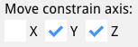
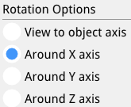

# EzyCad Usage Guide

## Table of Contents
1.  [Introduction](#introduction)
2.  [Getting Started](#getting-started)
3.  [User Interface](#user-interface)
4.  [File Operations](#file-operations)
5.  [Modeling Tools](#modeling-tools)
6.  [Keyboard Shortcuts](#keyboard-shortcuts)
7.  [View Controls](#view-controls)
8.  [Tips and Tricks](#tips-and-tricks)
9.  [Support](#support)
10. [Tool Icons](#tool-icons)

## Introduction

EzyCad (Easy CAD) is a CAD application for hobbyist machinists to design and edit 2D and 3D models for machining projects. It supports creating precise parts with tools for sketching, extruding, and applying geometric operations, using OpenGL, ImGui, and Open CASCADE Technology (OCCT). Export models to formats like STEP or STL for CNC machines or 3D printers, and try it in your browser with the WebAssembly version.

## Getting Started

### System Requirements
- Windows or, WebAssembly
   - Not Tested: Linux, or macOS operating system
- OpenGL-compatible graphics card

### Installation
1. Download the latest release for your operating system(TODO)
2. Extract the archive to your preferred location
3. Run the executable file

## User Interface

### Main Components
1. **Menu Bar**
   - File operations (New, Open, Save, [Import](#importing-3d-geometries))
   - Help and settings

2. **Toolbar**
   - Quick access to commonly used tools
   - Mode selection buttons
   - Operation tools

3. **Sketch List**
   - View and manage 2D sketches
   - Select and edit sketch elements
   - Toggle sketch visibility

4. **Shape List**
   - View and manage 3D shapes
   - Select and edit shape properties
   - Toggle shape visibility

5. **Options Panel**
   - Adjust tool parameters
   - Set operation properties
   - Configure view settings

6. **Log Window**
   - View operation history
   - Check for errors and warnings
   - Monitor system status

## File Operations

### Supported Formats
- Native format: `.ezy` files
- [Import formats: STEP, IGES, STL](#importing-3d-geometries)
- Export formats: STEP, IGES, STL

### Basic Operations
1. **New Project**
   - Start with a clean workspace
   - Reset all views and settings

2. **Open Project**
   - Load existing `.ezy` files
   - Restore previous work

3. **Save Project**
   - Save current work to `.ezy` file
   - Auto-save feature available

4. **Import/Export**
   - [Import external CAD files](#importing-3d-geometries)
   - Export to standard formats

## Modeling Tools

EzyCad uses a workflow-based approach to 3D modeling: start with 2D sketches, then transform them into 3D shapes using feature operations. This section covers both the sketching tools for creating 2D geometry and the 3D modeling tools for working with solid shapes.

### Workflow: From 2D Sketches to 3D Shapes

The typical modeling workflow in EzyCad follows these steps:

1. **Create a 2D Sketch**: Use the [2D Sketching tools](#2d-sketching) to draw 2D geometry on a sketch plane. Sketches consist of edges (lines, arcs, circles) that form closed shapes called faces.

2. **Extrude the Sketch**: Use the [Extrude tool](#extrude-sketch-face-tool-e) to convert 2D sketch faces into 3D solid shapes by extending them perpendicular to the sketch plane.

3. **Modify 3D Shapes**: Use [3D Modeling tools](#3d-modeling) to transform shapes (move, rotate, scale) or create patterns (polar duplicate).

4. **Apply Feature Operations**: Use boolean operations (cut, fuse, common) or feature operations (chamfer, fillet) to refine your 3D model.

**Key Concepts:**
- **Sketches** are 2D drawings on a plane that define the profile of your 3D shape
- **Faces** are closed regions within a sketch that can be extruded into 3D
- **Shapes** are 3D solid objects created from extruded sketch faces
- **Feature Operations** transform sketches into 3D geometry or modify existing 3D shapes

### Importing 3D Geometries

In addition to creating 3D shapes from sketches, EzyCad supports importing existing 3D geometry from external CAD files. This allows you to:

- **Work with existing designs**: Import models created in other CAD software
- **Combine workflows**: Use imported geometry alongside sketched shapes
- **Modify imported models**: Apply EzyCad's modeling tools to imported shapes

**Supported Import Formats:**
- **STEP** (`.step`, `.stp`): Standard format for exchanging 3D CAD data
- **IGES** (`.iges`, `.igs`): Legacy format for CAD data exchange
- **STL** (`.stl`): Common format for 3D printing and mesh data

**How to Import:**
1. Use the **File** menu and select **Import**
2. Choose a supported file format (STEP, IGES, or STL)
3. The imported 3D shapes will be added to your workspace
4. Imported shapes can be moved, rotated, and used in boolean operations just like shapes created from sketches

**Note**: Imported 3D geometries are added as solid shapes and can be combined with your sketched designs using boolean operations (cut, fuse, common) or modified using transform tools.

For detailed information on creating 2D geometry, see the [2D Sketching](#2d-sketching) section. For information on working with 3D shapes, see the [3D Modeling](#3d-modeling) section.

### 2D Sketching
1. **Basic Tools**
   - Add nodes
   - [Create line edges](#line-edge-creation-tools) 
   - [Draw multi-line edges](#multi-line-edge-tool) 
   - [Add arc segments](#arc-segment-creation-tool) 
   - [Create circles](#circle-creation-tools) 
   - [Draw rectangles and squares](#rectangle-and-square-creation-tools)  
   - [Add slots](#slot-creation-tool) 

2. **Sketch Operations**
   - [Define operation axis](#operation-axis-tool) 
   - Toggle edge dimensions
   - Mirror sketches
   - Create from face

#### Line Edge Creation Tools

EzyCad provides tools for creating individual line edges in sketch mode, allowing you to build complex geometries one edge at a time.

##### Single Line Edge Tool

The single line edge tool allows you to create straight line segments between two points.

**Features:**
- **Two-point creation**: Click to set the start point, then click to set the end point
- **Real-time preview**: See the line shape while moving the mouse
- **Precise length control**: Use the distance input dialog (Tab key) for exact line lengths
- **Snap support**: Automatically snaps to existing nodes and geometry
- **Dimension annotations**: Optional length dimensions can be displayed

**How to use:**
1. Select the **Line Edge** tool from the toolbar (line icon)
2. Click to set the start point of the line
3. Move the mouse to see a preview of the line
4. Click to set the end point, or press **Tab** to enter an exact length value
5. The line edge will be created and added to your sketch

**Keyboard shortcuts:**
- **Tab**: Open distance input dialog for precise length control
- **Escape**: Cancel the current line creation
- **Enter**: Finalize the line (if using distance input)
- **Right-click**: Complete the current line and start a new one

**Tips:**
- Use the snap feature to create lines that connect precisely to existing geometry
- Lines can be used as construction geometry or as part of your final design
- The line tool works in any sketch plane
- Multiple line edges can be created in sequence by right-clicking after each line

#### Multi-Line Edge Tool

The multi-line edge tool allows you to create multiple connected line segments in a single operation, making it efficient for drawing continuous paths, polylines, or complex connected geometries.

**Features:**
- **Continuous edge creation**: Click multiple points to create a chain of connected line segments
- **Real-time preview**: See each edge shape while moving the mouse before clicking
- **Precise length control**: Use the distance input dialog (Tab key) for exact edge lengths
- **Snap support**: Automatically snaps to existing nodes and geometry
- **Distance annotations**: Real-time distance display for the current edge being drawn
- **Flexible finalization**: Continue adding edges until you right-click to finalize the entire sequence

**How to use:**
1. Select the **Multi-line Edge** tool from the toolbar 
2. Click to set the first point (start of the first edge)
3. Move the mouse to see a preview of the first edge
4. Click to set the second point (end of first edge, start of second edge), or press **Tab** to enter an exact length value
5. Continue clicking to add more connected edges, each new click starts a new edge from the previous edge's end point
6. Press **Right-click** to finalize the entire multi-line sequence and add all edges to your sketch

**Keyboard shortcuts:**
- **Tab**: Open distance input dialog for precise length control of the current edge
- **Escape**: Cancel the entire multi-line creation operation
- **Enter**: Finalize the current edge length (if using distance input) and continue to the next edge
- **Right-click**: Finalize the entire multi-line sequence and complete the operation

**Workflow details:**
- Each click after the first creates a new edge connected to the previous edge's end point
- After entering a distance with Tab, the tool automatically starts a new edge from the end of the previous one
- The distance annotation shows the length of the edge currently being drawn
- All edges in the sequence are added to the sketch together when you right-click to finalize

**Tips:**
- Use the snap feature to create multi-line edges that connect precisely to existing geometry
- Multi-line edges are ideal for creating continuous paths, outlines, or complex connected shapes
- The tool works in any sketch plane
- Keep clicking to add more edges - there's no limit. For example, you can click 3 times to create 2 edges, or 10 times to create 9 edges. All edges remain temporary until you right-click, which adds all of them to your sketch at once
- If you make a mistake, press Escape to cancel the entire sequence and start over
- The last edge in the sequence will be removed if it hasn't been finalized (no end point set) when you right-click

**Comparison with Single Line Edge Tool:**
- **Single Line Edge**: Creates one edge at a time, finalizes automatically after two points
- **Multi-Line Edge**: Creates multiple connected edges in sequence, requires right-click to finalize
- Use single line edges when you need individual disconnected segments
- Use multi-line edges when you need a continuous chain of connected segments

#### Circle Creation Tools

EzyCad provides a method for creating circles in sketch mode using the **center-radius approach**.

##### Center-Radius Circle Tool

The center-radius circle tool allows you to create circles by defining a center point and a radius point.

**Features:**
- **Two-point creation**: Click to set the center, then click to set the radius
- **Real-time preview**: See the circle shape while dragging the radius point
- **Precise radius control**: Use the distance input dialog (Tab key) for exact radius values
- **Snap support**: Automatically snaps to existing nodes and geometry

**How to use:**
1. Select the **Circle** tool from the toolbar (circle icon)
2. Click to set the center point of the circle
3. Move the mouse to see a preview of the circle
4. Click to set the radius point, or press **Tab** to enter an exact radius value
5. The circle will be created and added to your sketch

**Keyboard shortcuts:**
- **Tab**: Open distance input dialog for precise radius control
- **Escape**: Cancel the current circle creation
- **Enter**: Finalize the circle (if using distance input)

**Tips:**
- Use the snap feature to create circles that are precisely positioned relative to existing geometry
- The circle tool works in any sketch plane
- Circles can be used as construction geometry or as part of your final design

##### Three-Point Circle Tool (Planned Feature)

**Status**: Not yet implemented

The three-point circle tool is planned for future development. This feature would allow creating circles by defining three points that lie on the circle's circumference.

**Planned Features:**
- **Three-point creation**: Click three points that lie on the circle's circumference
- **Automatic center and radius calculation**: The system would compute the center and radius from the three points
- **Geometric validation**: Ensure the three points are not collinear

**Note**: The toolbar icon  exists but the functionality is not yet implemented.

#### Circle Creation Workflow

The circle tool follows this workflow:

1. **Activate Tool**: Select the circle creation mode
2. **Point Placement**: Click to place the center point, then click to place the radius point
3. **Preview**: See real-time preview of the circle as you move the mouse
4. **Finalization**: Click to complete the circle creation
5. **Integration**: The circle becomes part of the sketch and can be used for further operations

**Common Operations with Circles:**
- **Extrusion**: Select the circle face and extrude to create cylindrical shapes
- **Boolean Operations**: Use circles in cut, fuse, or common operations
- **Pattern Creation**: Use circles as the basis for polar arrays or other patterns
- **Dimensioning**: Add radius or diameter dimensions to circles

**Error Handling:**
- **Coincident Points**: The system prevents creation of circles with zero radius
- **Invalid Geometry**: Circles that would be too small are rejected
- **Snap Integration**: Use existing snap points for precise circle placement

#### Arc Segment Creation Tool

The arc segment tool allows you to create circular arc edges by defining three points that lie on the arc: a start point, a middle point, and an end point.

**Features:**
- **Three-point creation**: Click to set the start point, then the middle point, then the end point
- **Real-time preview**: See the arc shape while moving the mouse after setting the first two points
- **Automatic finalization**: The arc is automatically created and added to your sketch after the third point is clicked
- **Circular arc**: Creates a smooth circular arc that passes through all three points
- **Snap support**: Automatically snaps to existing nodes and geometry
- **Unique points**: All three points must be different (cannot be coincident)

**How to use:**
1. Select the **Arc Segment** tool from the toolbar 
2. Click to set the start point of the arc (first point)
3. Click to set a point on the arc between start and end (middle point)
4. Move the mouse to see a preview of the arc
5. Click to set the end point of the arc (third point)
6. The arc segment will be automatically created and added to your sketch

**Point order:**
- **First click**: Start point - where the arc begins
- **Second click**: Middle point - a point that lies on the arc between start and end
- **Third click**: End point - where the arc ends

**Keyboard shortcuts:**
- **Escape**: Cancel the current arc creation (clears all points)
- **Note**: The arc is automatically finalized after the third point, so no manual finalization is needed

**Tips:**
- The three points define a unique circular arc that passes through all of them
- Use the snap feature to create arcs that connect precisely to existing geometry
- The arc tool works in any sketch plane
- Arc segments can be used as part of closed shapes that form faces
- The middle point helps define the arc's curvature and direction
- All three points must be unique - clicking the same point twice will be ignored

**Technical details:**
- The arc is created using the three points to define a circle, then trimming it to the arc segment
- Internally, the arc is represented as two connected edges for proper topology
- Arc segments can be combined with straight edges to create complex closed shapes

**Comparison with Circle Tool:**
- **Circle Tool**: Creates a full circle from center and radius point (2 points)
- **Arc Segment Tool**: Creates a partial arc from three points on the arc (3 points)
- Use circles when you need a complete circular shape
- Use arc segments when you need a curved edge that's part of a larger shape

#### Rectangle and Square Creation Tools

EzyCad provides three tools for creating rectangular shapes in sketch mode: square, rectangle from two points, and rectangle with center point.

##### Square Tool

The square tool allows you to create perfect squares by defining a center point and an edge midpoint.

**Features:**
- **Two-point creation**: Click to set the center point, then click to set the midpoint of one edge
- **Real-time preview**: See the square shape while moving the mouse
- **Perfect square**: Automatically ensures all sides are equal length
- **Orientation control**: The square's orientation is determined by the direction from center to edge midpoint
- **Precise size control**: Use the distance input dialog (Tab key) for exact side lengths
- **Snap support**: Automatically snaps to existing nodes and geometry

**How to use:**
1. Select the **Square** tool from the toolbar 
2. Click to set the center point of the square
3. Move the mouse to see a preview of the square
4. Click to set the midpoint of one edge (this defines both the size and orientation), or press **Tab** to enter an exact side length value
5. The square will be created with four edges and added to your sketch

**Keyboard shortcuts:**
- **Tab**: Open distance input dialog for precise side length control
- **Escape**: Cancel the current square creation
- **Enter**: Finalize the square (if using distance input)

**Tips:**
- The distance from center to edge midpoint determines half the side length
- Use the snap feature to create squares that are precisely positioned relative to existing geometry
- The square tool works in any sketch plane
- Squares automatically form closed faces that can be extruded

##### Rectangle Tool (Two Points)

The rectangle tool allows you to create rectangles by defining two opposite corners.

**Features:**
- **Two-point creation**: Click to set the first corner, then click to set the opposite corner
- **Real-time preview**: See the rectangle shape while moving the mouse
- **Precise size control**: Use the distance input dialog (Tab key) for exact dimensions
- **Snap support**: Automatically snaps to existing nodes and geometry
- **Automatic corner calculation**: The system automatically calculates the other two corners

**How to use:**
1. Select the **Rectangle** tool from the toolbar 
2. Click to set the first corner point
3. Move the mouse to see a preview of the rectangle
4. Click to set the opposite corner point, or press **Tab** to enter exact distance values
5. The rectangle will be created with four edges and added to your sketch

**Keyboard shortcuts:**
- **Tab**: Open distance input dialog for precise dimension control
- **Escape**: Cancel the current rectangle creation
- **Enter**: Finalize the rectangle (if using distance input)

**Tips:**
- The two points define opposite corners of the rectangle (diagonal)
- The rectangle edges are automatically aligned with the coordinate axes
- Use the snap feature to create rectangles that are precisely positioned relative to existing geometry
- The rectangle tool works in any sketch plane
- Rectangles automatically form closed faces that can be extruded

##### Rectangle Tool (Center Point)

The rectangle with center point tool allows you to create rectangles by defining a center point and a corner point.

**Features:**
- **Two-point creation**: Click to set the center point, then click to set a corner point
- **Real-time preview**: See the rectangle shape while moving the mouse
- **Centered creation**: The rectangle is centered on the first point
- **Precise size control**: Use the distance input dialog (Tab key) for exact dimensions
- **Snap support**: Automatically snaps to existing nodes and geometry

**How to use:**
1. Select the **Rectangle with Center Point** tool from the toolbar 
2. Click to set the center point of the rectangle
3. Move the mouse to see a preview of the rectangle
4. Click to set a corner point (defines both size and orientation), or press **Tab** to enter exact distance values
5. The rectangle will be created with four edges and added to your sketch

**Keyboard shortcuts:**
- **Tab**: Open distance input dialog for precise dimension control
- **Escape**: Cancel the current rectangle creation
- **Enter**: Finalize the rectangle (if using distance input)

**Tips:**
- The rectangle is centered on the first point you click
- The distance from center to corner determines the rectangle's dimensions
- Use the snap feature to create rectangles that are precisely positioned relative to existing geometry
- The rectangle tool works in any sketch plane
- Rectangles automatically form closed faces that can be extruded

**Comparison of Rectangle Tools:**
- **Rectangle (Two Points)**: Define opposite corners - useful when you know the corner positions
- **Rectangle (Center Point)**: Define center and corner - useful when you want the rectangle centered on a specific point
- **Square**: Always creates a perfect square - use when you need equal sides

#### Slot Creation Tool

The slot tool allows you to create an oblong or oval-shaped slot with rounded ends. A slot consists of two semicircular arcs connected by two straight parallel edges.

**Features:**
- **Three-point creation**: Click to set the first arc center, then the second arc center, then a point to define the radius
- **Real-time preview**: See the slot shape while moving the mouse after setting the first two points
- **Automatic finalization**: The slot is automatically created and added to your sketch after the third point is clicked
- **Rounded ends**: Creates semicircular arcs at both ends with equal radius
- **Parallel edges**: The two straight edges connecting the arcs are always parallel
- **Precise size control**: Use the distance input dialog (Tab key) for exact dimensions
- **Snap support**: Automatically snaps to existing nodes and geometry

**How to use:**
1. Select the **Slot** tool from the toolbar 
2. Click to set the center point of the first arc (start of slot)
3. Move the mouse to see a preview of the first edge
4. Click to set the center point of the second arc (end of slot)
5. Move the mouse to see a preview of the slot shape
6. Click to set a point that defines the radius of the arcs, or press **Tab** to enter exact distance values
   - **Important**: The radius is measured from the second arc center (the point you clicked in step 4) to this third point
   - This radius determines the cross section: the slot's cross-section dimension equals 2 × radius
7. The slot will be automatically created with two arcs and two straight edges and added to your sketch

**Point order:**
- **First click**: First arc center - the center of the arc at one end of the slot
- **Second click**: Second arc center - the center of the arc at the other end of the slot
- **Third click**: Radius point - defines the radius of both arcs
  - The distance from the **second arc center** (second click) to this point determines the arc radius
  - The slot's cross section (perpendicular to the slot length) equals twice this radius
  - Both arcs use the same radius, creating a symmetric slot

**Keyboard shortcuts:**
- **Tab**: Open distance input dialog for precise dimension control
- **Escape**: Cancel the current slot creation
- **Enter**: Finalize the slot (if using distance input)
- **Note**: The slot is automatically finalized after the third point, so no manual finalization is needed

**Tips:**
- The slot length is determined by the distance between the first and second arc centers
- The radius of both arcs is determined by the distance from the second arc center to the radius point (third click)
- The slot's cross section (the dimension perpendicular to the slot length) equals 2 × radius
  - This is because each arc is a semicircle with the specified radius, extending equally in both perpendicular directions
  - For example, if you click the radius point 3 units away from the second arc center, the slot cross section will be 6 units
- Both arcs have the same radius, creating a symmetric slot shape
- The slot orientation (which dimension is length vs width/height) is determined by the direction from the first to the second arc center
- Use the snap feature to create slots that connect precisely to existing geometry
- The slot tool works in any sketch plane
- Slots automatically form closed faces that can be extruded
- The slot orientation is determined by the direction from the first to the second arc center

**Technical details:**
- The slot consists of four edges: two semicircular arcs and two straight parallel edges
- The arcs are created using the arc segment functionality
- The straight edges connect the arcs at their endpoints
- The slot forms a closed shape suitable for face creation and extrusion

**Common use cases:**
- Creating mounting slots for screws or bolts
- Designing elongated holes for adjustment
- Creating rounded-end cutouts in parts
- Designing slots for sliding mechanisms

#### Operation Axis Tool

The operation axis tool allows you to define a reference line for mirroring and revolving operations in sketches.

**Features:**
- **Two-point definition**: Click to set the start point, then click to set the end point of the axis line
- **Real-time preview**: See the axis line while moving the mouse
- **Automatic redefinition**: If an axis already exists, clicking again will clear it and start defining a new one
- **Mirror operations**: Use the defined axis to mirror selected edges
- **Revolve operations**: Use the defined axis to revolve selected edges or faces

**How to Use:**
1. Select the **Operation Axis** tool from the toolbar 
2. Click to set the start point of the axis line
3. Move the mouse to see a preview of the axis line
4. Click to set the end point to finalize the axis
5. Once defined, the axis can be used for mirror or revolve operations

**Redefining the Axis:**
- If an operation axis already exists and you click again in operation axis mode, the existing axis will be automatically cleared and you can start defining a new one
- Alternatively, use the "Clear axis" button in the options panel to manually clear the axis

**Using the Operation Axis:**
Once an axis is defined, the options panel will show:
- **Mirror button**: Mirrors selected edges across the operation axis
- **Revolve button**: Revolves selected edges or faces around the operation axis
- **Revolve angle input**: Set the angle for revolve operations (default: 360 degrees)
- **Clear axis button**: Manually clear the current operation axis

**Keyboard Shortcuts:**
- **Escape**: Cancel the current axis definition
- **Enter**: Finalize the axis (after setting both points)

**Tips:**
- The operation axis is a reference line used for geometric transformations
- Select edges or faces before using the Mirror or Revolve operations
- The axis can be redefined at any time by clicking again in operation axis mode
- Use snap points for precise axis placement relative to existing geometry

### 3D Modeling
1. **Transform Operations**
   - [Move shapes (G)](#shape-move-tool-g) 
   - [Rotate objects (R)](#shape-rotate-tool-r) 
   - Scale elements [`To-dos` not implemented]
   - [Polar duplicate](#shape-polar-duplicate-tool) 

#### Shape Move Tool (G)

The shape move tool allows you to reposition selected shapes in the 3D viewer with precision and flexibility.

**Features:**
- **Axis Constraints:** Restrict movement to the X, Y, or Z axis by toggling axis constraints in the options panel or using keyboard shortcuts.
- **Interactive Distance Editing:** Enter or adjust the distance moved along each axis for precise control. Real-time feedback is provided in the viewer and options panel.
- **Improved Plane Handling:** The move plane is automatically estimated based on the center of the selected shapes, making movement more intuitive.
- **Finalization Logic:** The move operation completes when you confirm the action (e.g., `left mouse button`).
- **Reset and Cancel:** Press `Esc` to cancel and revert to the original position at any time during the move operation.

**How to Use:**
1. **Activate Move Tool:** Select one or more shapes and press `G` or click the  icon.
2. **Constrain Movement (Optional):** Use the options panel to lock movement to a specific axis, or use keyboard shortcuts (e.g., `X`, `Y`, `Z`).

   
   
   *Example: Movement constrained on the Y and Z axes.*
3. **Edit Distance (Optional):**  
While moving a shape, you can press `Tab` to activate a floating distance input box for the current axis. If no axis constraints are set, you can edit distances for X, Y, and Z in sequence. If axis constraints are enabled, only the allowed axes are available for editing. After entering a distance, that axis is locked to the specified value. Pressing `Tab` again advances to the next available axis. After the distances for all participating axises are defined, the more will be finalized.

4. **Finalize or Cancel:** Press the `left mouse button` to confirm and apply the move, or `Esc` to cancel and revert.

**Tips:**
- Use axis constraints for straight-line moves.
- Use interactive distance editing for precise adjustments.
- You can always cancel and try again if the move isn't as expected.

#### Shape Rotate Tool (R)

The shape rotate tool enables precise rotation of selected shapes around a specified axis in the 3D viewer.

**Features:**
- **Rotation Axis Options:** Choose between view-to-object rotation or constrain rotation to X, Y, or Z axis.
- **Interactive Angle Editing:** Enter or adjust the rotation angle for precise control with real-time preview.
- **Visual Feedback:** The rotation axis is displayed with color-coded indicators (Red for X, Green for Y, Blue for Z).

**How to Use:**
1. **Activate Rotate Tool:** Select one or more shapes and press `R` or click the  icon. You can also activate the tool and select the shape(s) to rotate afterwards.
2. **Select Rotation Axis: (Optional)**
   
   

   *Example: Rotation around on the X axis.*
   - Press `X` to rotate around the X-axis (Red)
   - Press `Y` to rotate around the Y-axis (Green)
   - Press `Z` to rotate around the Z-axis (Blue)
   - Press the same axis key again to switch to view-to-object rotation

3. **Edit Angle (Optional):**
   - Press `Tab` to activate the angle input box
   - Enter the desired rotation angle in degrees
   - The preview updates in real-time as you adjust the angle
   - Pressing enter finializes the rotation

4. **Finalize or Cancel:**
   - Press the `left mouse button` to confirm and apply the rotation
   - Press `Esc` to cancel and revert to the original position

**Tips:**
- Use view-to-object rotation for intuitive free-form rotation
- Use axis constraints for precise rotations around specific axes
- The rotation center point is displayed as a red dot for reference
   - Visible in wirefame rendering of the shape(s)
- You can combine rotation with other operations for complex transformations

## Feature Operations

### Extrude Sketch Face Tool (E)

The extrude tool allows you to create 3D solid shapes by extruding 2D sketch faces along a direction perpendicular to the sketch plane.

**Features:**
- **Direct face selection**: Click directly on a sketch face to select it for extrusion
- **Automatic view adjustment**: The view automatically rotates if the face plane is parallel to the view plane (within 5 degrees), providing better visibility for the extrusion operation
- **Real-time preview**: See the extruded shape update in real-time as you move the mouse
- **Interactive distance control**: Drag the mouse to adjust extrusion distance, or use the distance input dialog (Tab key) for precise control
- **Distance annotation**: A dimension annotation displays the current extrusion distance
- **Bidirectional extrusion**: The extrusion direction is determined by which side of the face plane you move the mouse to

**How to Use:**
1. **Activate Extrude Tool**: Press `E` or click the  icon to enter extrude mode
2. **Select Face**: Click on a sketch face that you want to extrude
   - The face must be part of a closed sketch (forming a valid face)
   - The system will automatically select the face closest to the camera if multiple faces overlap
3. **Adjust Extrusion Distance**:
   - **Mouse drag**: Move the mouse to adjust the extrusion distance in real-time
   - **Precise input**: Press `Tab` to open the distance input dialog and enter an exact extrusion distance
   - The distance annotation shows the current extrusion distance
4. **Finalize**: Click the left mouse button to confirm and create the extruded shape
5. **Cancel**: Press `Esc` at any time to cancel the extrusion operation

**Keyboard Shortcuts:**
- `E`: Activate extrude mode
- `Tab`: Open distance input dialog for precise extrusion distance
- `Esc`: Cancel current extrusion operation
- `Enter`: Finalize extrusion (when using distance input)

**Tips:**
- Extrude works best when the view is not directly parallel to the sketch plane - the system will automatically rotate the view if needed
- Use the distance input dialog for precise measurements
- The extrusion direction depends on which side of the face plane you move the mouse to
- Multiple faces from the same sketch can be extruded separately
- Extruded shapes can be used in boolean operations (cut, fuse, common)

**Common Use Cases:**
- **Extrusion**: Select the circle face and extrude to create cylindrical shapes
- **Base features**: Create the base feature of a part by extruding a profile
- **Additive features**: Extrude additional features on existing parts
- **Through features**: Extrude holes or cutouts by using the cut operation after extrusion

#### Shape Polar Duplicate Tool

The polar duplicate tool allows you to create multiple copies of selected shapes arranged in a circular pattern around a rotation center point.

**Features:**
- **Circular array**: Creates multiple copies of shapes arranged in a circular pattern
- **Configurable angle**: Set the total angle for the pattern (default: 360 degrees)
- **Configurable count**: Set the number of duplicate elements to create (default: 5)
- **Rotation option**: Choose whether duplicates are rotated as they're copied (default: enabled)
- **Combine option**: Choose whether to combine all duplicates into a single shape (default: enabled)
- **Polar arm definition**: Define the rotation center and direction by clicking a point

**How to use:**
1. **Select shapes**: Select one or more shapes that you want to duplicate
2. **Activate Polar Duplicate Tool**: Click the  icon to enter polar duplicate mode
3. **Define polar arm**: Move the mouse to see a preview line (polar arm) from the shape center to the mouse cursor
4. **Set rotation center**: Click to set the end point of the polar arm
   - The start of the polar arm is at the center of the selected shape(s)
   - The end point you click defines the rotation center and direction
5. **Configure options** in the options panel:
   - **Polar angle**: Set the total angle for the pattern (e.g., 360° for full circle, 180° for half circle)
   - **Num Elms**: Set the number of duplicate elements to create
   - **Rotate dups**: Checkbox to rotate each duplicate as it's copied (default: enabled)
   - **Combine dups**: Checkbox to combine all duplicates into a single shape (default: enabled)
6. **Create duplicates**: Click the **"Dup"** button in the options panel to create the polar duplicates

**Options explained:**
- **Polar angle**: The total angular span of the pattern. 360° creates a full circle, 180° creates a half circle, etc.
- **Num Elms**: The number of duplicate elements to create. The original shape is not counted, so 5 elements means 5 copies plus the original.
- **Rotate dups**: When enabled, each duplicate is rotated around its own center as it's positioned. When disabled, duplicates maintain their original orientation.
- **Combine dups**: When enabled, all duplicates are fused together into a single shape. When disabled, each duplicate remains a separate shape.

**Keyboard shortcuts:**
- **Escape**: Cancel the current polar duplicate operation

**Tips:**
- The polar arm defines both the rotation center (at the arm's end point) and the starting direction
- Use the polar duplicate tool to create patterns like gear teeth, radial arrays, or circular arrangements
- The rotation center is determined by where you click to set the polar arm end point
- If "Combine dups" is enabled, all duplicates are fused into one shape, which is useful for creating complex patterns
- If "Rotate dups" is disabled, all duplicates maintain the same orientation as the original
- The tool works with multiple selected shapes - all selected shapes will be duplicated together

**Common use cases:**
- Creating gear teeth or radial patterns
- Arranging objects in a circular pattern
- Creating symmetric designs with rotational symmetry
- Duplicating features around a center point

### Other Feature Operations

- Create chamfers
- Add fillets
- Boolean operations:
  - Cut
  - Fuse
  - Common

## Keyboard Shortcuts

### General Operations
- `Ctrl+O`: Open file
- `Ctrl+S`: Save file
- `Ctrl+Shift+S`: Save as
- `Esc`: Cancel current operation
- `Enter`: Confirm current operation
- `Tab`: Dimension input
- `Delete`: Remove selected elements

### Modeling Shortcuts
- `G`: Move mode
- `E`: Extrude mode
- `D`: Delete selected
- `L`: (Reserved for future use)

## View Controls

### Mouse Controls
- **Left Click**: Select object
- **Left drag**: Orbit view
- **Middle drag**: Pan view
- **Right drag**: Zoom
- **Scroll Wheel**: Zoom in/out

### View Options
- Reset view
- Fit to screen
- Toggle wireframe
- Change material appearance
- Adjust lighting

## Tips and Tricks

### Efficient Modeling
1. Use keyboard shortcuts for common operations
2. Utilize the toolbar for quick access to tools
3. Take advantage of the dimension input feature
4. Use the log window to track operations

### Troubleshooting
1. Check the log window for error messages
2. Verify file permissions for save operations
3. Ensure sufficient system resources
4. Update graphics drivers if experiencing display issues

### Performance Optimization
1. Close unused sketches and shapes
2. Use wireframe mode for complex models
3. Optimize view settings for your hardware
4. Regular save operations to prevent data loss

## Support

### Documentation
- This usage guide
- Online documentation
- Video tutorials

### Community
- User forums
- GitHub repository
- Issue tracking

### Updates
- Regular feature updates
- Bug fixes
- Performance improvements

## Tool Icons

### Basic Operations
-  - Inspection mode
-  - Shape move (G)
-  - Shape rotate
-  - Shape scale

### Sketch Tools
-  - Sketch inspection mode
-  - Create sketch from face
-  - Define operation axis
-  - Add node
-  - Add line edge
-  - Add multi-line edge
-  - Add arc circle
-  - Add square
-  - Add rectangle from two points
-  - Add rectangle with center point
-  - Add circle (center and radius)
-  - Add circle from three points *(planned feature)*
-  - Add slot
-  - Toggle edge dimension annotation

### 3D Operations
-  - Extrude sketch face (E)
-  - Chamfer
-  - Fillet
-  - Shape polar duplicate

### Boolean Operations
-  - Shape cut
-  - Shape fuse
-  - Shape common

---

For more information, visit the official EzyCad website or GitHub repository.
