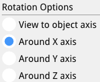

# EzyCad Usage Guide

## Table of Contents
1.  [Introduction](#introduction)
2.  [Getting Started](#getting-started)
3.  [User Interface](#user-interface)
4.  [File Operations](#file-operations)
5.  [Edit Operations](#edit-operations)
6.  [Modeling Tools](#modeling-tools)
7.  [Keyboard Shortcuts](#keyboard-shortcuts)
8.  [View Controls](#view-controls)
9.  [Tips and Tricks](#tips-and-tricks)
10. [Support](#support)
11. [Tool Icons](#tool-icons)

## Introduction

EzyCad (Easy CAD) is a CAD application for hobbyist machinists to design and edit 2D and 3D models for machining projects. It supports creating precise parts with tools for sketching, extruding, and applying geometric operations, using OpenGL, ImGui, and Open CASCADE Technology (OCCT). Export models to formats like STEP or STL for CNC machines or 3D printers, and try it in your browser with the WebAssembly version.

## Getting Started

### System Requirements
- Windows or, WebAssembly
   - Not Tested: Linux, or macOS operating system
- OpenGL-compatible graphics card

### Installation
1. Download the latest release for your operating system — see [README](README.md) for build instructions; automated builds and releases are not yet available (see [issue #45](https://github.com/trailcode/EzyCad/issues/45))
2. Extract the archive to your preferred location
3. Run the executable file

## User Interface

### Main Components
1. **Menu Bar**
   - **File** — [New](#new-project), [Open](#open-project), [Save](#save-project), Save as, [Import](#importing-3d-geometries), Examples, Exit
   - **Edit** — [Undo](#edit-operations), [Redo](#edit-operations)
   - **View** — [Settings, panes and options](#help-and-settings)
   - **Help** — [About, Usage Guide](#help-and-settings)

2. **Toolbar**
   - Quick access to commonly used tools
   - Mode selection buttons
   - Operation tools

3. **Sketch List**
   - [View and manage 2D sketches](#sketch-list)
   - [Select and edit sketch elements](#sketch-list)
   - [Toggle sketch visibility](#sketch-list)

4. **Shape List**
   - View and manage 3D shapes
   - Select and edit shape properties
   - Toggle shape visibility

5. **Options Panel**
   - Adjust tool parameters
   - Set operation properties
   - Configure view settings

6. **Log Window**
   - View operation history
   - Check for errors and warnings
   - Monitor system status

### Help and Settings

**View menu** — Toggle panes and open settings:
- **Settings** — Opens the Settings dialog. Use it to adjust:
  - **Dark mode** — Toggle dark theme.
  - **3D view background** — Background gradient colors and blend direction.
  - **3D view grid** — Grid colors.
  - **Defaults** — Restore default settings.
- **Options** — Show or hide the Options panel.
- **Sketch List** — Show or hide the [Sketch List](#sketch-list) pane.
- **Shape List** — Show or hide the Shape List pane.
- **Log** — Show or hide the Log window.
- **Lua Console** — Show or hide the Lua console (if available).
- **Debug** — Show or hide the debug pane (debug builds only).

**Help menu**
- **About** — Opens the [project README](README.md) in the browser.
- **Usage Guide** — Opens [this usage guide](usage.md) in the browser.

**Saving settings** — **File → Save settings** (Emscripten) or the application’s save-on-exit behavior saves current layout, view, and the above options so they persist next time you run EzyCad.

### Sketch List

The **Sketch List** pane lists all 2D sketches in the current document. Open it from **View → Sketch List**.

For each sketch you can:

- **Set current** — Use the radio button (○) to make this sketch the current one. The current sketch is used for editing and for operations such as [extrude](#extrude-sketch-face-tool-e).
- **Rename** — Click the name field and type to change the sketch’s name.
- **Visibility** — Use the checkbox to show or hide the sketch in the 3D view.
- **Delete** — Right‑click the sketch name and choose **Delete** to remove the sketch from the document.

The window can be closed with its close button; use **View → Sketch List** again to show it.

## File Operations

### Supported Formats
- Native format: `.ezy` files
- [Import formats: STEP, IGES, STL](#importing-3d-geometries)
- Export formats: STEP, IGES, STL (not implemented; see [issue #44](https://github.com/trailcode/EzyCad/issues/44))

### Basic Operations
1. #### New Project
   - Start with a clean workspace
   - Reset settings (view is not reset; see [issue #43](https://github.com/trailcode/EzyCad/issues/43))

2. #### Open Project
   - Load existing `.ezy` files

3. #### Save Project
   - Save current work to `.ezy` file

4. **Import/Export**
   - [Import external CAD files](#importing-3d-geometries)
   - Export to standard formats (not implemented; see [issue #44](https://github.com/trailcode/EzyCad/issues/44))

## Edit Operations

Edit operations change your model (sketches or 3D shapes) and can be navigated with undo/redo.

- **Delete selected**
  - Use <kbd>D</kbd> or the <kbd>Delete</kbd> key to remove the currently selected sketch elements or shapes.
  - Deletions are recorded in the undo history and can be undone/redone.

- **Undo and Redo**

  EzyCad includes document-level undo/redo for both sketches and 3D shapes.

  - **What it does**
    - Tracks modeling operations as steps in a history stack (sketch edits, [extrudes](#extrude-sketch-face-tool-e), [boolean operations](#other-feature-operations), [transforms](#3d-modeling), etc.).
    - Undo/redo restores the **model state only**; the 3D view (camera) is intentionally not changed so you can review changes from a consistent perspective.
    - When you undo or redo a step, the application returns to the mode that was active for that operation (e.g., sketch inspection vs normal inspection).

  - **Shortcuts**
    - <kbd>Ctrl</kbd>+<kbd>Z</kbd> — Undo last operation.
    - <kbd>Ctrl</kbd>+<kbd>Y</kbd> or <kbd>Ctrl</kbd>+<kbd>Shift</kbd>+<kbd>Z</kbd> — Redo.
    - These shortcuts work even when focus is in a pane such as Sketch List, Options, or Log.

  - **Limits and notes**
    - The history keeps a fixed number of recent steps (currently 50).

### Cancel current operation (Esc)

Press <kbd>Esc</kbd> to cancel the current action or step back to a broader mode.

- **If something is in progress:** <kbd>Esc</kbd> cancels it and discards the change. Examples: cancel a line you are drawing, revert an unconfirmed [move](#shape-move-tool-g)/[rotate](#shape-rotate-tool-r)/[scale](#shape-scale-tool-s), cancel [extrude](#extrude-sketch-face-tool-e) preview, clear the distance or angle input dialog.
- **If nothing is in progress:** <kbd>Esc</kbd> steps the application to the **parent mode** (one level up):
  - From a **sketch tool** (e.g. Add line, Add circle, Operation axis) → **Sketch inspection mode**.
  - From **Sketch inspection**, **Normal**, or any **shape tool** ([Move](#shape-move-tool-g), [Rotate](#shape-rotate-tool-r), [Scale](#shape-scale-tool-s), [Extrude](#extrude-sketch-face-tool-e), [Chamfer](#other-feature-operations), [Fillet](#other-feature-operations), [Polar duplicate](#shape-polar-duplicate-tool), [Create sketch from face](usage-sketch.md#create-sketch-from-planar-face-tool)) → **Normal** (inspection) mode.

So repeated <kbd>Esc</kbd> from a sketch drawing tool first cancels the current element, then returns to Sketch inspection, then to Normal.

## Modeling Tools

EzyCad uses a workflow-based approach to 3D modeling: start with 2D sketches, then transform them into 3D shapes using feature operations. This section covers both the sketching tools for creating 2D geometry and the 3D modeling tools for working with solid shapes.

### Workflow: From 2D Sketches to 3D Shapes

The typical modeling workflow in EzyCad follows these steps:

1. **Create a 2D Sketch**: Use the [2D Sketching tools](usage-sketch.md) to draw 2D geometry on a sketch plane. Sketches consist of edges (lines, arcs, circles) that form closed shapes called faces.

2. **Extrude the Sketch**: Use the [Extrude tool](#extrude-sketch-face-tool-e) to convert 2D sketch faces into 3D solid shapes by extending them perpendicular to the sketch plane.

3. **Modify 3D Shapes**: Use [3D Modeling tools](#3d-modeling) to transform shapes ([move](#shape-move-tool-g), [rotate](#shape-rotate-tool-r), [scale](#shape-scale-tool-s)) or create patterns ([polar duplicate](#shape-polar-duplicate-tool)).

4. **Apply Feature Operations**: Use [boolean operations](#other-feature-operations) (cut, fuse, common) or [feature operations](#other-feature-operations) (chamfer, fillet) to refine your 3D model.

**Key Concepts:**

| | |
| ---: | --- |
| **Sketches** | 2D drawings on a plane that define the profile of your 3D shape |
| **Faces** | Closed regions within a sketch that can be [extruded](#extrude-sketch-face-tool-e) into 3D |
| **Shapes** | 3D solid objects created from extruded sketch faces |
| **Feature Operations** | Transform sketches into 3D geometry or modify existing 3D shapes |

### Importing 3D Geometries

In addition to creating 3D shapes from sketches, EzyCad supports importing existing 3D geometry from external CAD files. This allows you to:

| | |
| ---: | --- |
| **Work with existing designs** | Import models created in other CAD software |
| **Combine workflows** | Use imported geometry alongside sketched shapes |
| **Modify imported models** | Apply EzyCad's modeling tools to imported shapes |

**Supported Import Formats:**

| | |
| ---: | --- |
| **STEP** (`.step`, `.stp`) | Standard format for exchanging 3D CAD data |
| **IGES** (`.iges`, `.igs`) | Legacy format for CAD data exchange |
| **STL** (`.stl`) | Common format for 3D printing and mesh data |

**How to Import:**
1. Use the **File** menu and select **Import**
2. Choose a supported file format (STEP, IGES, or STL)
3. The imported 3D shapes will be added to your workspace
4. Imported shapes can be moved, rotated, and used in [boolean operations](#other-feature-operations) just like shapes created from sketches

**Note**: Imported 3D geometries are added as solid shapes and can be combined with your sketched designs using [boolean operations](#other-feature-operations) (cut, fuse, common) or modified using [transform tools](#3d-modeling).

For detailed information on creating 2D geometry, see the [2D Sketching](usage-sketch.md) guide. For information on working with 3D shapes, see the [3D Modeling](#3d-modeling) section.

### 2D Sketching

See the **[2D Sketching guide](usage-sketch.md)** for full documentation of sketch tools: line and multi-line edges, circles, arcs, rectangles, squares, slots, operation axis, edge dimensions, and creating a sketch from a planar face.

### 3D Modeling
1. **Transform Operations**
   -  [Move shapes (G)](#shape-move-tool-g)
   -  [Rotate objects (R)](#shape-rotate-tool-r)
   -  [Scale elements (S)](#shape-scale-tool)
   -  [Polar duplicate](#shape-polar-duplicate-tool)

#### Shape Move Tool (G)

The shape move tool allows you to reposition selected shapes in the 3D viewer with precision and flexibility.

**Features:**

| | |
| ---: | --- |
| **Axis Constraints** | Restrict movement to the X, Y, or Z axis by toggling axis constraints in the options panel or using keyboard shortcuts. |
| **Interactive Distance Editing** | Enter or adjust the distance moved along each axis for precise control. Real-time feedback is provided in the viewer and options panel. |
| **Improved Plane Handling** | The move plane is automatically estimated based on the center of the selected shapes, making movement more intuitive. |
| **Finalization Logic** | The move operation completes when you confirm the action (e.g., <kbd>left mouse button</kbd>). |
| **Reset and Cancel** | Press <kbd>Esc</kbd> to cancel and revert to the original position at any time during the move operation. |

**How to Use:**
1. **Activate Move Tool:**  Select one or more shapes and press <kbd>G</kbd> or click the icon.
2. **Constrain Movement (Optional):** Use the options panel to lock movement to a specific axis, or use keyboard shortcuts (e.g., <kbd>X</kbd>, <kbd>Y</kbd>, <kbd>Z</kbd>).

   
   
   *Example: Movement constrained on the Y and Z axes.*
3. **Edit Distance (Optional):**  
While moving a shape, you can press <kbd>Tab</kbd> to activate a floating distance input box for the current axis. If no axis constraints are set, you can edit distances for X, Y, and Z in sequence. If axis constraints are enabled, only the allowed axes are available for editing. After entering a distance, that axis is locked to the specified value. Pressing <kbd>Tab</kbd> again advances to the next available axis. After the distances for all participating axises are defined, the more will be finalized.

4. **Finalize or Cancel:** Press the <kbd>left mouse button</kbd> to confirm and apply the move, or <kbd>Esc</kbd> to cancel and revert.

**Tips:**
- Use axis constraints for straight-line moves.
- Use interactive distance editing for precise adjustments.
- You can always cancel and try again if the move isn't as expected.

#### Shape Rotate Tool (R)

The shape rotate tool enables precise rotation of selected shapes around a specified axis in the 3D viewer.

**Features:**

| | |
| ---: | --- |
| **Rotation Axis Options** | Choose between view-to-object rotation or constrain rotation to X, Y, or Z axis. |
| **Interactive Angle Editing** | Enter or adjust the rotation angle for precise control with real-time preview. |
| **Visual Feedback** | The rotation axis is displayed with color-coded indicators (Red for X, Green for Y, Blue for Z). |

**How to Use:**
1. **Activate Rotate Tool:**  Select one or more shapes and press <kbd>R</kbd> or click the icon. You can also activate the tool and select the shape(s) to rotate afterwards.
2. **Select Rotation Axis: (Optional)**
   
   

   *Example: Rotation around on the X axis.*
   - Press <kbd>X</kbd> to rotate around the X-axis (Red)
   - Press <kbd>Y</kbd> to rotate around the Y-axis (Green)
   - Press <kbd>Z</kbd> to rotate around the Z-axis (Blue)
   - Press the same axis key again to switch to view-to-object rotation

3. **Edit Angle (Optional):**
   - Press <kbd>Tab</kbd> to activate the angle input box
   - Enter the desired rotation angle in degrees
   - The preview updates in real-time as you adjust the angle
   - Pressing enter finializes the rotation

4. **Finalize or Cancel:**
   - Press the <kbd>left mouse button</kbd> to confirm and apply the rotation
   - Press <kbd>Esc</kbd> to cancel and revert to the original position

**Tips:**
- Use view-to-object rotation for intuitive free-form rotation
- Use axis constraints for precise rotations around specific axes
- The rotation center point is displayed as a red dot for reference
   - Visible in wirefame rendering of the shape(s)
- You can combine rotation with other operations for complex transformations

#### Shape Scale Tool (S)

The shape scale tool allows you to uniformly scale selected shapes around a computed center point.

**Features:**

| | |
| ---: | --- |
| **Automatic center detection** | The scale center is estimated from the bounding box center of the selected shapes. |
| **Screen-plane scaling** | Scaling happens in a plane derived from the current view, making the interaction intuitive. |
| **Interactive preview** | Moving the mouse adjusts the scale factor and updates the shapes in real time. |
| **Safe bounds** | The scale factor is clamped to a reasonable range (e.g., between very small and very large values) to avoid degenerate geometry. |

**How to Use:**

1. **Select shapes:** Select one or more shapes in the 3D view or Shape List.
2. **Activate Scale Tool:**  Click the *Shape scale* icon in the toolbar (or choose Scale from the Edit/Transform area if present).  
3. **Move the mouse:**  
   - The tool computes a scale center and a view-aligned plane.  
   - Moving the mouse away from or toward the center changes the scale factor and previews the scaled result.
4. **Finalize:** Confirm the operation (e.g., by clicking to complete the interaction) to apply the scale permanently.
5. **Cancel:** Press <kbd>Esc</kbd> to cancel and revert to the original shape sizes.

**Tips:**

- Scale works best when the view direction makes the movement relative to the center easy to see (avoid looking exactly edge-on at the objects).
- Because the operation is undoable, you can experiment with different scale amounts and step back with <kbd>Ctrl</kbd>+<kbd>Z</kbd> if needed.

## Feature Operations

### Extrude Sketch Face Tool (E)

The extrude tool allows you to create 3D solid shapes by extruding 2D sketch faces along a direction perpendicular to the sketch plane.

**Features:**

| | |
| ---: | --- |
| **Direct face selection** | Click directly on a sketch face to select it for extrusion |
| **Automatic view adjustment** | The view automatically rotates if the face plane is parallel to the view plane (within 5 degrees), providing better visibility for the extrusion operation |
| **Real-time preview** | See the extruded shape update in real-time as you move the mouse |
| **Interactive distance control** | Drag the mouse to adjust extrusion distance, or use the distance input dialog (<kbd>Tab</kbd> key) for precise control |
| **Distance annotation** | A dimension annotation displays the current extrusion distance |
| **Bidirectional extrusion** | The extrusion direction is determined by which side of the face plane you move the mouse to |

**How to Use:**
1. **Activate Extrude Tool**:  Press <kbd>E</kbd> or click the icon to enter extrude mode
2. **Select Face**: Click on a sketch face that you want to extrude
   - The face must be part of a closed sketch (forming a valid face)
   - The system will automatically select the face closest to the camera if multiple faces overlap
3. **Adjust Extrusion Distance**:
   - **Mouse drag**: Move the mouse to adjust the extrusion distance in real-time
   - **Precise input**: Press <kbd>Tab</kbd> to open the distance input dialog and enter an exact extrusion distance
   - The distance annotation shows the current extrusion distance
4. **Finalize**: Click the <kbd>left mouse button</kbd> to confirm and create the extruded shape
5. **Cancel**: Press <kbd>Esc</kbd> at any time to cancel the extrusion operation

**Keyboard Shortcuts:**

| | |
| ---: | --- |
| <kbd>E</kbd> | Activate extrude mode |
| <kbd>Tab</kbd> | Open distance input dialog for precise extrusion distance |
| <kbd>Esc</kbd> | Cancel current extrusion operation |
| <kbd>Enter</kbd> | Finalize extrusion (when using distance input) |

**Tips:**
- Extrude works best when the view is not directly parallel to the sketch plane - the system will automatically rotate the view if needed
- Use the distance input dialog for precise measurements
- The extrusion direction depends on which side of the face plane you move the mouse to
- Multiple faces from the same sketch can be extruded separately
- Extruded shapes can be used in [boolean operations](#other-feature-operations) (cut, fuse, common)

**Common Use Cases:**

| | |
| ---: | --- |
| **Extrusion** | Select the circle face and [extrude](#extrude-sketch-face-tool-e) to create cylindrical shapes |
| **Base features** | Create the base feature of a part by [extruding](#extrude-sketch-face-tool-e) a profile |
| **Additive features** | [Extrude](#extrude-sketch-face-tool-e) additional features on existing parts |
| **Through features** | Extrude holes or cutouts by using the [cut](#other-feature-operations) operation after extrusion |

#### Shape Polar Duplicate Tool

The polar duplicate tool allows you to create multiple copies of selected shapes arranged in a circular pattern around a rotation center point.

**Features:**

| | |
| ---: | --- |
| **Circular array** | Creates multiple copies of shapes arranged in a circular pattern |
| **Configurable angle** | Set the total angle for the pattern (default: 360 degrees) |
| **Configurable count** | Set the number of duplicate elements to create (default: 5) |
| **Rotation option** | Choose whether duplicates are rotated as they're copied (default: enabled) |
| **Combine option** | Choose whether to combine all duplicates into a single shape (default: enabled) |
| **Polar arm definition** | Define the rotation center and direction by clicking a point |

**How to use:**
1. **Select shapes**: Select one or more shapes that you want to duplicate
2. **Activate Polar Duplicate Tool**:  Click the icon to enter polar duplicate mode
3. **Define polar arm**: Move the mouse to see a preview line (polar arm) from the shape center to the mouse cursor
4. **Set rotation center**: Click to set the end point of the polar arm
   - The start of the polar arm is at the center of the selected shape(s)
   - The end point you click defines the rotation center and direction
5. **Configure options** in the options panel:
   - **Polar angle**: Set the total angle for the pattern (e.g., 360° for full circle, 180° for half circle)
   - **Num Elms**: Set the number of duplicate elements to create
   - **Rotate dups**: Checkbox to rotate each duplicate as it's copied (default: enabled)
   - **Combine dups**: Checkbox to combine all duplicates into a single shape (default: enabled)
6. **Create duplicates**: Click the **"Dup"** button in the options panel to create the polar duplicates

**Options explained:**

| | |
| ---: | --- |
| **Polar angle** | The total angular span of the pattern. 360° creates a full circle, 180° creates a half circle, etc. |
| **Num Elms** | The number of duplicate elements to create. The original shape is not counted, so 5 elements means 5 copies plus the original. |
| **Rotate dups** | When enabled, each duplicate is rotated around its own center as it's positioned. When disabled, duplicates maintain their original orientation. |
| **Combine dups** | When enabled, all duplicates are fused together into a single shape. When disabled, each duplicate remains a separate shape. |

**Keyboard shortcuts:**

| | |
| ---: | --- |
| <kbd>Escape</kbd> | Cancel the current polar duplicate operation |

**Tips:**
- The polar arm defines both the rotation center (at the arm's end point) and the starting direction
- Use the polar duplicate tool to create patterns like gear teeth, radial arrays, or circular arrangements
- The rotation center is determined by where you click to set the polar arm end point
- If "Combine dups" is enabled, all duplicates are fused into one shape, which is useful for creating complex patterns
- If "Rotate dups" is disabled, all duplicates maintain the same orientation as the original
- The tool works with multiple selected shapes - all selected shapes will be duplicated together

**Common use cases:**
- Creating gear teeth or radial patterns
- Arranging objects in a circular pattern
- Creating symmetric designs with rotational symmetry
- Duplicating features around a center point

### Other Feature Operations

- Create chamfers
- Add fillets
- Boolean operations:
  - Cut
  - Fuse
  - Common

## Keyboard Shortcuts

### General Operations

| | |
| ---: | --- |
| <kbd>Ctrl</kbd>+<kbd>Z</kbd> | Undo last operation |
| <kbd>Ctrl</kbd>+<kbd>Y</kbd> / <kbd>Ctrl</kbd>+<kbd>Shift</kbd>+<kbd>Z</kbd> | Redo |
| <kbd>Ctrl</kbd>+<kbd>O</kbd> | Open file |
| <kbd>Ctrl</kbd>+<kbd>S</kbd> | Save file |
| <kbd>Ctrl</kbd>+<kbd>Shift</kbd>+<kbd>S</kbd> | Save as |
| <kbd>Esc</kbd> | [Cancel current operation or step to parent mode](#cancel-current-operation-esc) |
| <kbd>Enter</kbd> | Confirm current operation |
| <kbd>Tab</kbd> | Distance/dimension input |
| <kbd>Shift</kbd>+<kbd>Tab</kbd> | Angle input (for line edges with angle constraint) |
| <kbd>Delete</kbd> | Remove selected elements |

### Modeling Shortcuts

| | |
| ---: | --- |
| <kbd>G</kbd> | Move mode |
| <kbd>R</kbd> | Rotate mode |
| <kbd>S</kbd> | Scale mode |
| <kbd>E</kbd> | Extrude mode |
| <kbd>D</kbd> | Delete selected |

## View Controls

### Mouse Controls

| | |
| ---: | --- |
| **Left Click** | Select object |
| **Left drag** | Orbit view |
| **Middle drag** | Pan view |
| **Right drag** | Zoom |
| **Scroll Wheel** | Zoom in/out |

### View Options

| | |
| ---: | --- |
| **Reset view** | Reset the 3D view |
| **Fit to screen** | Fit the model to the viewport |
| **Toggle wireframe** | Switch wireframe display |
| **Change material appearance** | Adjust material display |
| **Adjust lighting** | Change lighting settings |

## Tips and Tricks

### Efficient Modeling
1. Use keyboard shortcuts for common operations
2. Utilize the toolbar for quick access to tools
3. Take advantage of the dimension input feature (<kbd>Tab</kbd> for distance, <kbd>Shift</kbd>+<kbd>Tab</kbd> for angle)
4. Use angle constraints for precise angular control when creating line edges
5. Use the log window to track operations

### Troubleshooting
1. Check the log window for error messages
2. Verify file permissions for save operations
3. Ensure sufficient system resources
4. Update graphics drivers if experiencing display issues

### Performance Optimization
1. Close unused sketches and shapes
2. Use wireframe mode for complex models
3. Optimize view settings for your hardware
4. Regular save operations to prevent data loss

## Support

### Documentation
- [This usage guide](#ezycad-usage-guide)
- Online documentation (TODO)
- Video tutorials (TODO)

### Community
- [User forums](https://github.com/trailcode/EzyCad/discussions)
- [GitHub repository](https://github.com/trailcode/EzyCad)
- [Issue tracking](https://github.com/trailcode/EzyCad/issues)

### Updates
- Regular feature updates
- Bug fixes
- Performance improvements

## Tool Icons

### Basic Operations
-  - Inspection mode
-  - Shape move (<kbd>G</kbd>)
-  - Shape rotate (<kbd>R</kbd>)
-  - Shape scale (<kbd>S</kbd>)

### Sketch Tools
-  - Sketch inspection mode
-  - Create sketch from planar face
-  - Define operation axis
-  - Add node
-  - Add line edge
-  - Add multi-line edge
-  - Add arc circle
-  - Add square
-  - Add rectangle from two points
-  - Add rectangle with center point
-  - Add circle (center and radius)
-  - Add circle from three points *(planned feature)*
-  - Add slot
-  - Toggle edge dimension annotation

### 3D Operations
-  - Extrude sketch face (<kbd>E</kbd>)
-  - Chamfer
-  - Fillet
-  - Shape polar duplicate

### Boolean Operations
-  - Shape cut
-  - Shape fuse
-  - Shape common

---

For more information, see the [README](README.md) or the [GitHub repository](https://github.com/trailcode/EzyCad).
